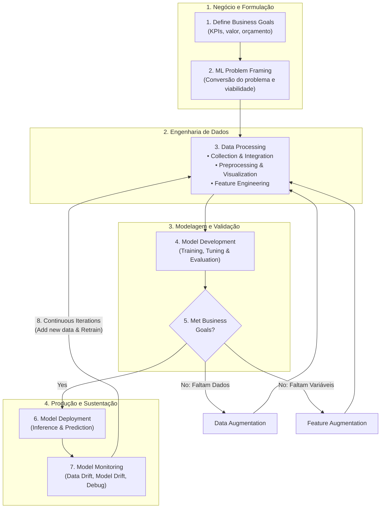
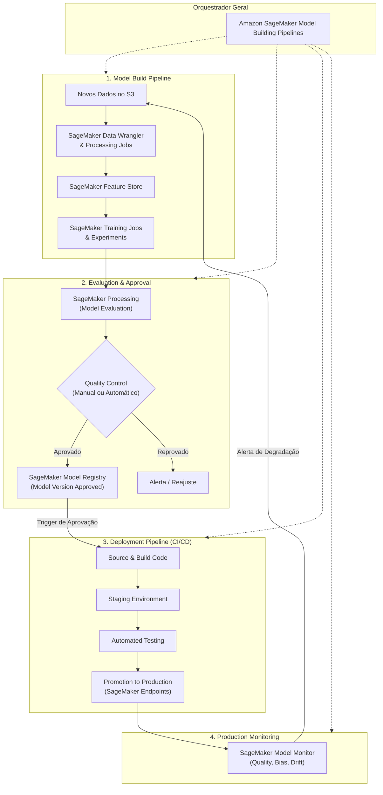

# Módulo 04 — Developing Machine Learning Solutions

---

## 📌 Introdução Geral ao Módulo

Este módulo apresenta uma visão profunda e completa do **Ciclo de Vida de Machine Learning (ML Lifecycle)** de ponta a ponta e demonstra como utilizar os serviços da **Amazon Web Services (AWS)** em cada uma das etapas. 

Ao longo deste estudo, você aprenderá:
* O processo completo de desenvolvimento, desde a concepção do objetivo de negócio até o retreinamento contínuo.
* As diferentes fontes e implementações de modelos de Machine Learning (modelos pré-treinados, algoritmos nativos, frameworks e contêineres customizados).
* Técnicas estatísticas e de negócio para avaliar a performance de modelos de classificação e regressão.
* Os fundamentos, princípios, benefícios e arquitetura de **MLOps (Machine Learning Operations)** para automatizar, governar e colocar modelos em produção com segurança.

---

## 1. Ciclo de Vida de Desenvolvimento de ML (ML Development Lifecycle)

O **ML Development Lifecycle** refere-se ao processo integral de ponta a ponta para **desenvolver, implantar e manter** modelos de Machine Learning. Diferente do desenvolvimento de software tradicional, o ciclo de ML é intrinsecamente **iterativo** e experimental.



### Detalhamento Passo a Passo das 8 Fases do Ciclo

#### 1. Define Business Goals (Definição dos Objetivos de Negócio)
* Todo projeto de ML começa obrigatoriamente com um objetivo de negócio claro.
* Os stakeholders de negócio definem o **valor agregado**, o **orçamento disponível** e os **critérios formais de sucesso**.
* A definição dos critérios de sucesso ou **Key Performance Indicators (KPIs)** para a carga de trabalho de ML é crítica (ex.: aumentar faturamento, reduzir taxa de abandono/churn, cortar custos operacionais).

#### 2. ML Problem Framing (Formulação do Problema de ML)
* Consiste em articular o problema de negócio e convertê-lo em um problema formal de Machine Learning.
* Cientistas de dados, engenheiros de dados e arquitetos de ML trabalham em conjunto com os especialistas no assunto (**SMEs - Subject Matter Experts**) da linha de negócio.
* **Fase de Descoberta (Discovery):** A equipe avalia se ML é realmente a abordagem adequada para resolver o problema e determina se a organização possui dados suficientes, qualidade adequada e as habilidades técnicas necessárias para entregar a solução.

#### 3. Data Processing (Processamento de Dados)
Depois de formular o problema, os dados brutos são convertidos em um formato utilizável para o treinamento de modelos precisos. Esta fase é dividida em três etapas essenciais:
* **Data Collection and Integration (Coleta e Integração de Dados):** Garante que os dados brutos de fontes diversas sejam consolidados em um local centralmente acessível.
* **Data Preprocessing and Visualization (Pré-processamento e Visualização):** Transforma dados brutos em formato limpo e compreensível, tratando valores ausentes, inconsistências e realizando análise exploratória.
* **Feature Engineering (Engenharia de Recursos):** O processo de criar, transformar, extrair e selecionar as variáveis (*features*) mais relevantes a partir dos dados.

#### 4. Model Development (Desenvolvimento do Modelo)
* Composto por **treinamento (training)**, **ajuste de parâmetros (tuning)** e **avaliação (evaluation)**.
* É um processo altamente iterativo. Inicialmente, o modelo quase nunca apresenta os resultados desejados no primeiro treino. Por isso, desenvolvedores realizam rodadas adicionais de engenharia de recursos e ajustam os hiperparâmetros antes de retreinar.

#### 5. Retrain / Decisão de Negócio
* Se o modelo avaliado não atinge os objetivos de negócio estabelecidos, é necessário reexaminar os dados e variáveis para identificar melhorias.
* Pode envolver a coleta de mais dados (*Data Augmentation*), criação de novos atributos (*Feature Augmentation*) ou novo ajuste fino de hiperparâmetros de treinamento.

#### 6. Model Deployment (Implantação do Modelo)
* Quando o desempenho do modelo atinge os padrões exigidos, ele é implantado em um ambiente de produção para realizar predições e inferências contra dados reais.

#### 7. Model Monitoring (Monitoramento do Modelo)
* O sistema de monitoramento garante que o modelo mantenha o nível de performance desejado ao longo do tempo através da detecção precoce de anomalias e mitigação de desvios.
* Auxilia na depuração de falhas técnicas (*debugging*) e na compreensão contínua do comportamento do modelo em ambiente real.

#### 8. Iterations (Iterações Contínuas)
* O ciclo de ML não termina na implantação; ele é um processo contínuo de refinamento à medida que novos dados chegam ou que as regras e requisitos do negócio evoluem.
* Exige uma colaboração integrada entre diferentes perfis: **Product Managers, Desenvolvedores, Cientistas de Dados e Engenheiros de Operações**.

---

### 1.1 Estudo de Caso Real: Roteamento de Chamadas na Amazon (Amazon Call Center)

Há alguns anos, a Amazon enfrentou o desafio de otimizar o roteamento de suas centrais de atendimento telefônico e recorreu ao Machine Learning para solucionar o problema.

#### 📞 O Cenário e os Objetivos de Negócio (Business Goals)
* **Sistema Original:** O cliente ligava e ouvia um menu de opções estático: *"Disque 1 para Devoluções, Disque 2 para Kindle, Disque 3 para..."*. O cliente escolhia uma opção e era direcionado a um atendente com treinamento específico.
* **O Problema:** Como a Amazon vende milhões de produtos diferentes, a lista de assuntos possíveis é praticamente infinita. Quando a opção correta não estava no menu, o cliente era enviado para um atendente generalista ou para o especialista errado. Esse atendente precisava descobrir o problema e transferir a ligação novamente.
* **Impacto:** Lidar com centenas de milhões de chamadas por ano com esse formato gerava desperdício massivo de tempo, custos exorbitantes com transferências sucessivas e, principalmente, uma péssima experiência para o cliente.

#### 🎯 Formulação do Problema de ML (Problem Formulation)
* **Objetivo de Negócio:** Direcionar os clientes aos atendentes com as habilidades (*skills*) certas logo na primeira tentativa, reduzindo drasticamente as transferências de chamadas.
* **Conversão em ML:** Identificar padrões no histórico e perfil do cliente para **prever qual habilidade de atendente resolverá a chamada**.
* **Tipo de Problema de ML:** **Multiclass Classification (Classificação Multiclasse)** em aprendizado supervisionado, pois existiam múltiplos tipos de atendentes/habilidades possíveis para prever.

#### 📥 Coleta e Integração de Dados (Data Collection and Integration)
* **Abordagem:** Aprendizado supervisionado baseado no histórico de chamadas anteriores, contendo os rótulos corretos das habilidades dos atendentes que resolveram cada caso.
* **Variáveis/Features Criadas:** Respostas para perguntas como:
  * *"Quais foram os pedidos recentes do cliente?"*
  * *"O cliente possui um dispositivo Kindle?"*
  * *"O cliente é membro do Amazon Prime?"*

#### 🧹 Pré-processamento e Visualização (Preprocessing & Visualization)
* **Análise Crítica dos Rótulos (Labels):** A equipe fez perguntas estratégicas:
  * *Existem rótulos que devemos excluir por motivos de negócio?*
  * *Existem rótulos imprecisos ou ruidosos?*
  * *Existem rótulos parecidos que podem ser combinados para simplificar o modelo?*
* **Exemplo de Consolidação:** Múltiplas habilidades específicas relacionadas a Kindle foram unificadas em um único rótulo abrangente *"Kindle Skill"*. Assim, qualquer cliente com problemas em Kindle era enviado a atendentes treinados em todos os aspectos do dispositivo.
* **Visualização:** Análise programática para entender a distribuição dos dados (ex.: descobriu-se que 40% das chamadas eram sobre Devoluções, 30% sobre Prime e 30% sobre Kindle).

#### 🧪 Treinamento e Particionamento dos Dados (Model Training)
* O objetivo central do ML é a **capacidade de generalização** para dados nunca vistos.
* **Por que não avaliar com os dados de treino?** Avaliar o modelo com os mesmos dados de treino recompensa a memorização (*decoreba*) e não mede se o modelo realmente aprendeu a generalizar.
* **Estratégia de Divisão de Dados:** Separação dos dados rotulados nas proporções:
  * **80% Treinamento / 10% Validação / 10% Teste** (ou alternativa comum de **70% / 15% / 15%**).

#### ⚖️ Ajuste de Hiperparâmetros e Engenharia de Recursos (Tuning & Feature Engineering)
* **Hyperparameter Optimization:** Ajustou-se a taxa de aprendizado (*learning rate*). Se o modelo aprende rápido demais, oscila e nunca atinge o valor ótimo; se aprende devagar demais, demora excessivamente e pode não convergir no número de épocas estipulado.
* **Feature Engineering Contínuo:** Inclusão de variáveis temporais (ex.: horário do último pedido). O algoritmo só aprende com o que é explicitamente fornecido a ele.

#### 🚀 Implantação e Resultados (Deployment & Evaluation)
* O modelo foi implantado em produção e monitorado contra o KPI de negócio estabelecido.
* **Validação:** A hipótese confirmou-se na prática: o número de transferências caiu significativamente, reduzindo custos operacionais e melhorando substancialmente a satisfação dos clientes.

---

## 2. Amazon SageMaker AI: Plataforma Gerenciada de ML

O **Amazon SageMaker AI** (nova nomenclatura para o serviço gerenciado SageMaker) unifica em uma única interface visual todas as ferramentas necessárias para construir, treinar, implantar e monitorar soluções de ML.

```mermaid
flowchart LR
    subgraph DataPrep ["1. Preparação de Dados"]
        DW["SageMaker Data Wrangler\n(LCNC / Visual)"]
        EMR["Studio Classic + EMR / Glue\n(Escala Interativa)"]
        PROC["Processing API\n(Scripts customizados)"]
        FS["Feature Store\n(Online & Offline)"]
    end

    subgraph TrainTune ["2. Treino & Ajuste"]
        TJ["SageMaker Training Jobs\n(Compute gerenciado)"]
        CANV["SageMaker Canvas\n(AutoML sem código)"]
        JS["SageMaker JumpStart\n(Modelos pré-treinados)"]
        EXP["SageMaker Experiments\n(Rastreamento)"]
        AMT["Automatic Model Tuning\n(Hiperparâmetros)"]
        MR["SageMaker Model Registry\n(Governança e Catálogo)"]
    end

    subgraph DeployMon ["3. Deploy & Monitoramento"]
        DEP["SageMaker Deployments\n(Endpoints / Batch)"]
        MM["SageMaker Model Monitor\n(Desvio de dados e viés)"]
    end

    DataPrep --> TrainTune --> DeployMon
    
    PIPE["SageMaker Model Building Pipelines (Orquestração CI/CD)"]
    PIPE -.-> DataPrep
    PIPE -.-> TrainTune
    PIPE -.-> DeployMon
```



### 2.1 Ferramentas do SageMaker por Fase do Ciclo

#### 1. Coleta, Análise e Preparação de Dados
* **Amazon SageMaker Data Wrangler:** Ferramenta Low-Code/No-Code (LCNC) baseada na web para importar, preparar, transformar, extrair features e analisar dados visualmente. Permite adicionar scripts Python customizados e exportar os fluxos para jobs de processamento ou pipelines.
* **Integração com Amazon EMR e AWS Glue Interactive Sessions:** Integrado nativamente no SageMaker Studio Classic para cientistas que precisam preparar grandes volumes de dados de forma interativa e distribuída.
* **SageMaker Processing API:** Permite rodar scripts e notebooks para processamento, transformação e análise de grandes conjuntos de dados utilizando frameworks populares (Scikit-Learn, PyTorch, MXNet) em infraestrutura totalmente gerenciada.

#### 2. Gerenciamento e Compartilhamento de Features
* **Amazon SageMaker Feature Store:** Repositório centralizado e governado para criar, armazenar, compartilhar e gerenciar atributos (*features*).
  * **Online Feature Store:** Otimizado para leitura de baixíssima latência (milissegundos) para alimentar **inferências em tempo real**.
  * **Offline Feature Store:** Armazenamento em lote no Amazon S3, utilizado para **treinamento de modelos** e **inferência em lote (batch)**.

#### 3. Treinamento e Avaliação de Modelos
* **SageMaker Training Jobs:** Provisiona clusters de computação sob demanda, executa o script/algoritmo contra os dados do S3 e grava os artefatos resultantes de volta no Amazon S3.
* **Amazon SageMaker Canvas:** Opção visual sem código (LCNC) voltada para analistas de negócios gerarem previsões preditivas via **AutoML** sem precisar programar.
* **Amazon SageMaker JumpStart:** Central que disponibiliza modelos abertos e proprietários pré-treinados de ponta para dezenas de tarefas, permitindo fine-tuning e deploy em 1 clique.
* **Amazon SageMaker Experiments:** Permite rastrear, organizar, comparar e analisar experimentos com múltiplas combinações de datasets, hiperparâmetros e algoritmos, avaliando o impacto incremental na acurácia.
* **Amazon SageMaker Automatic Model Tuning:** Executa múltiplos jobs em paralelo/sequencial testando diferentes combinações de hiperparâmetros para encontrar a versão com melhor desempenho segundo a métrica desejada.

#### 4. Implantação e Monitoramento
* **SageMaker Model Registry:** Catálogo central de governança onde modelos são versionados, avaliados e formalmente aprovados ou rejeitados para promoção em produção.
* **SageMaker Deployment:** Fornece endpoints com HTTPS seguro, provisionamento de hardware dedicado ou sem servidor e escalabilidade automática (*auto-scaling*).
* **Amazon SageMaker Model Monitor:** Monitora a qualidade dos modelos operando em produção (contínuo ou agendado). Emite alertas automáticos contra 4 tipos de degradação:
  1. *Data Quality Drift:* Violação no schema ou tipos de dados que chegam em produção.
  2. *Model Quality Drift:* Queda da acurácia com base em rótulos reais coletados a posteriori.
  3. *Bias Drift:* Aparecimento de vieses estatísticos contra determinados grupos.
  4. *Feature Attribution Drift:* Mudança na importância relativa das variáveis ao longo do tempo.

---

### 2.2 Ambientes e Aplicações do SageMaker Studio

O **SageMaker Studio** é a interface web integrada padrão para acessar todos os recursos de Machine Learning:

| Aplicação / Ferramenta | Descrição e Finalidade |
|---|---|
| **JupyterLab** | Ambiente interativo para criar e executar cadernos Jupyter, escrever código e explorar dados. |
| **Amazon SageMaker Canvas** | Ferramenta No-Code para analistas de negócio construírem modelos de Machine Learning (AutoML) sem código. |
| **RStudio** | IDE dedicada e integrada para desenvolvedores e estatísticos que trabalham na linguagem R. |
| **Code Editor** | Baseado no Visual Studio Code (Open Source), oferecendo suporte completo a extensões populares da comunidade. |
| **Automated ML (AutoML)** | Funcionalidade do Canvas que automatiza a escolha de algoritmos, engenharia de variáveis e ajuste de parâmetros. |
| **Model Evaluations** | Módulo do SageMaker Studio focado na avaliação técnica e responsável de LLMs e Foundation Models (qualidade, toxicidade, etc.). |

---

## 3. Fontes de Modelos de ML no SageMaker

Existem 4 formas graduais de implementar modelos no Amazon SageMaker, balanceando esforço e controle:

```
[1. Pre-trained Models (JumpStart)] ──> Menor esforço; pronto para uso imediato ou fine-tuning
            ↓
[2. Built-in Algorithms da AWS]     ──> Médio esforço; otimizados para grandes massas de dados
            ↓
[3. Pre-made Framework Images]       ──> Alto esforço; traz scripts próprios (PyTorch, TensorFlow, Scikit-learn)
            ↓
[4. Custom Docker Images]           ──> Maior esforço/controle; empacota pacotes, bibliotecas e binários específicos
```

---

### 3.1 Mapeamento Completo dos Algoritmos Built-in da AWS

A AWS fornece algoritmos pré-construídos e altamente escaláveis para as seguintes classes de problemas:

#### 📊 1. Supervised Learning (Supervisionado)
Atende problemas de **Classificação** (prever classes) e **Regressão** (prever números contínuos):
* **Linear Learner:** Algoritmo linear versátil para classificação binária/multiclasse ou regressão.
* **Factorization Machines:** Recomendado para datasets com dados altamente esparsos (ex.: sistemas de recomendação de produtos).
* **XGBoost (Extreme Gradient Boosting):** Algoritmo de árvores de decisão impulsionadas, referência mundial para dados estruturados/tabulares.
* **K-Nearest Neighbors (KNN):** Classificação ou regressão baseada na distância geométrica dos $k$ vizinhos mais próximos.

#### 🔍 2. Unsupervised Learning (Não Supervisionado)
Opera sobre dados **não rotulados**:
* **Clustering:** **K-means** (agrupa dados com características semelhantes).
* **Topic Modeling:** **Latent Dirichlet Allocation (LDA)** (descobre tópicos latentes em textos).
* **Embeddings:** **Object2Vec** (cria representações vetoriais densas para pares de entidades, como cliente-produto).
* **Anomaly Detection:**
  * **Random Cut Forest (RCF):** Detecta pontos anômalos em dados numéricos e séries temporais.
  * **IP Insights:** Identifica anomalias em comportamentos de requisições de endereços IP (segurança cibernética).
* **Dimensionality Reduction:** **Principal Component Analysis (PCA)** (reduz o número de features preservando a maior variância).

#### 🖼️ 3. Processamento de Imagens, Vídeos e Séries Temporais
* **Image Classification:** Classificação de imagens utilizando implementações baseadas em MXNet e TensorFlow (ex.: arquiteturas ResNet).
* **Object Detection:** Identifica e delimita caixas (*bounding boxes*) ao redor de objetos na imagem.
* **Semantic Segmentation:** Classifica cada pixel da imagem individualmente utilizando redes como:
  * *Fully Convolutional Network (FCN)*
  * *Pyramid Scene Parsing (PSP)*
  * *DeepLab V3 com ResNet*
* **Time Series (Séries Temporais):** **DeepAR** (algoritmo baseado em redes neurais recorrentes para gerar previsões probabilísticas pontuais e de intervalo em séries temporais).

#### 📝 4. Text Analysis & Speech (Análise de Texto e Voz)
* **Text Classification & Word Embeddings:** **BlazingText** (altamente otimizado para classificação de texto e geração de embeddings Word2Vec em escala).
* **Machine Translation & Speech:** **Sequence to Sequence (Seq2Seq)** (utilizado para tradução de idiomas e síntese/transcrição de fala).
* **Topic Modeling:** **LDA** e **Neural Topic Modeling (NTM)**.

#### 🚀 SageMaker JumpStart
* Permite descobrir, avaliar, customizar com fine-tuning incremental e implantar modelos open-source e proprietários líderes do mercado em um clique.
* Fornece **Templates de Solução** completos com infraestrutura pronta via AWS CloudFormation e cadernos de exemplo (*sample notebooks*) executáveis.

---

## 4. Avaliação de Performance de Modelos de ML

### 4.1 Conjuntos de Dados para Avaliação (Splitting)

Para avaliar um modelo de forma justa e evitar conclusões enganosas, divide-se o conjunto total de dados rotulados em três frações:

```
┌────────────────────────────────────────────────────────────────────────┐
│                        Dataset Rotulado Total                          │
└────────────────────────────────────────────────────────────────────────┘
     │                                    │                            │
     ▼ (70% a 80%)                        ▼ (10% a 15%)                ▼ (10% a 15%)
┌─────────────────────────┐   ┌────────────────────────┐   ┌────────────────────────┐
│      Training Set       │   │     Validation Set     │   │        Test Set        │
│ O modelo analisa e      │   │ Avalia em ambiente fora│   │ Prova real final;      │
│ ajusta seus parâmetros/ │   │ do treino; guia o      │   │ avalia a acurácia      │
│ pesos internos.         │   │ ajuste de hiper-       │   │ definitiva antes de ir │
│                         │   │ parâmetros (tuning).   │   │ para a produção.       │
└─────────────────────────┘   └────────────────────────┘   └────────────────────────┘
```

> ⚠️ **Princípio Fundamental:** Nunca avalie um modelo usando o mesmo dataset em que ele foi treinado. Isso mede apenas a capacidade de memorização do algoritmo, e não sua habilidade de generalizar para novos casos.

---

### 4.2 Ajuste do Modelo (Model Fit): Overfitting, Underfitting e Balanceamento

Compreender o **Model Fit** é o primeiro passo para identificar a causa raiz da baixa acurácia e saber qual ação corretiva aplicar. O diagnóstico é feito comparando o erro no treino contra o erro na avaliação:

| Estado | Erro no Treino | Erro na Avaliação | Causa do Problema | O que significa na prática |
|---|---|---|---|---|
| **Underfitting** | 🔴 Alto | 🔴 Alto | O modelo é simples demais para capturar a relação entre as variáveis de entrada ($X$) e a variável alvo ($Y$). | O modelo não conseguiu aprender os padrões básicos nem nos dados que viu repetidamente. |
| **Overfitting** | 🟢 Muito Baixo | 🔴 Alto | O modelo é complexo demais e memorizou o ruído e particularidades específicas do treino. | O modelo é excelente para o passado (treino), mas falha ao receber qualquer dado novo. |
| **Balanced** | 🟢 Baixo | 🟢 Baixo | Encontrou o equilíbrio ótimo entre simplicidade e capacidade representativa. | O modelo capturou a estrutura real dos dados e **generaliza** confiavelmente. |

---

### 4.3 Viés (Bias) e Variância (Variance): A Analogia dos Alvos (*Bullseyes*)

Erros em dados não vistos derivam de dois fatores matemáticos:

* **Viés (Bias):** A **distância/gap** entre o valor médio previsto pelo modelo e o valor real que se busca prever. Viés alto significa que o modelo parte de suposições erradas sobre a relação dos dados (gera **underfitting**).
* **Variância (Variance):** A **sensibilidade e dispersão** das previsões frente a oscilações e ruídos nos dados. Variância alta significa que o modelo muda drasticamente suas previsões se mudar a amostra de dados (gera **overfitting**).

#### 🎯 Os 4 Cenários do Alvo de Dardos (*Bullseye Analogy*)
* **Centro do alvo (🎯):** É o rótulo/valor real esperado (*Ground Truth*).
* **Cada dardo lançado (•):** É uma predição feita pelo modelo.

```
       [Baixa Variância]                [Alta Variância]
    (Previsões concentradas)          (Previsões espalhadas)

┌─────────────────────────────┐   ┌─────────────────────────────┐
│          (     )            │   │          (  •  )            │
│         (   •   )           │   │       • (  •    )           │
│        (  •••🎯•• )         │   │        (  •🎯 • )  •        │
│         (   •   )           │   │         (   •  )            │
│          (     )            │   │          (     )            │
│   Baixo Bias / Baixa Var    │   │    Baixo Bias / Alta Var    │
│   🎯 BALANCEADO (IDEAL)     │   │      (Média boa, disperso)  │
└─────────────────────────────┘   └─────────────────────────────┘

┌─────────────────────────────┐   ┌─────────────────────────────┐
│          (     )            │   │          (     )     •        │
│         (       )           │   │         (       )           │
│        (   🎯   )           │   │        (   🎯   )   •       │
│         (       )           │   │         (       )  •        │
│       •••(     )            │   │          (     )      •     │
│    Alto Bias / Baixa Var    │   │    Alto Bias / Alta Var     │
│  (Consistente, mas errado)  │   │     (Pior caso: caótico)    │
└─────────────────────────────┘   └─────────────────────────────┘
```

> ⭐ **O Algoritmo Ideal:** Possui **baixo viés** (modela a relação real com precisão) e **baixa variância** (produz previsões consistentes e estáveis em diferentes conjuntos de dados).

---

### 4.4 Avaliação de Problemas de Classificação vs. Regressão

A escolha das métricas de avaliação depende estritamente do tipo de problema de Machine Learning em estudo:

| Categoria do Problema | Natureza da Saída | Principais Métricas de Avaliação |
|---|---|---|
| **Classificação** | Classes discretas, categorias, rótulos categóricos | Accuracy, Precision, Recall, F1-Score, AUC-ROC |
| **Regressão** | Valores numéricos contínuos (ex.: preços, temperatura, tempo) | Mean Squared Error (MSE), R² (R-squared) |

---

### 4.5 Métricas de Problemas de Classificação

#### Exemplo Prático: Classificação Binária ("Cat" vs. "Not Cat")
Considere um sistema de visão computacional treinado para classificar fotos em **"gato" (cat)** ou **"não gato" (not cat)**.

O processo formal de avaliação desse classificador ocorre em **3 passos**:
1. **Passo 1 (Send held-out observations):** Enviar ao modelo as observações do conjunto de teste reservado, onde os rótulos reais já são conhecidos com certeza.
2. **Passo 2 (Compare predictions):** Comparar a previsão emitida pelo modelo com o rótulo real que a observação possui.
3. **Passo 3 (Compute summary metric):** Calcular uma métrica estatística consolidada que indique o grau de acerto entre os valores previstos e reais.

---

#### A Matriz de Confusão

A matriz de confusão cruza os resultados reais com as previsões do modelo em quatro quadrantes fundamentais:

```
                              PREDIÇÃO DO MODELO
                      Positivo ("Cat")      Negativo ("Not Cat")
                  ┌──────────────────────┬──────────────────────┐
 Real: "Cat"      │  True Positive (TP)  │ False Negative (FN)  │
 (Positivo)       │  ✅ Acertou o gato   │ ❌ Erro: Não viu gato│
                  ├──────────────────────┼──────────────────────┤
 Real: "Not Cat"  │ False Positive (FP)  │  True Negative (TN)  │
 (Negativo)       │ ❌ Erro: Alarme falso│ ✅ Acertou o não-gato│
                  └──────────────────────┴──────────────────────┘
```

* **1. True Positive (TP):** Rótulo real é "cat" e modelo previu "cat" (resultado correto e positivo).
* **2. True Negative (TN):** Rótulo real é "not cat" e modelo previu "not cat" (resultado correto e negativo).
* **3. False Positive (FP):** Rótulo real é "not cat", mas o modelo previu "cat" (alarme falso / erro positivo).
* **4. False Negative (FN):** Rótulo real é "cat", mas o modelo previu "not cat" (omissão / erro negativo).

---

#### 1. Acurácia (Accuracy)
$$\text{Accuracy} = \frac{TP + TN}{TP + TN + FP + FN}$$
* Soma todas as predições corretas e divide pelo total de predições.
* **Limitação Importante:** Torna-se enganosa em **datasets desbalanceados** (ex.: se 95% das instâncias forem "not cat", um modelo burro que preveja sempre "not cat" terá 95% de acurácia sem nunca detectar um único gato).

#### 2. Precisão (Precision)
$$\text{Precision} = \frac{TP}{TP + FP}$$
* Mede a proporção de predições positivas que estavam de fato corretas (remove os negativos da jogada).
* **Quando priorizar:** Quando o **custo do Falso Positivo for intolerável**.
  * *Exemplo:* **Filtro de Spam** — não queremos que um e-mail legítimo e crucial de negócios seja marcado incorretamente como spam (FP) e ocultado do usuário.

#### 3. Recall / Sensibilidade (Sensitivity)
$$\text{Recall} = \frac{TP}{TP + FN}$$
* Mede a proporção de casos positivos reais que o modelo conseguiu detectar com sucesso.
* **Quando priorizar:** Quando o **custo do Falso Negativo for catastrófico**.
  * *Exemplo:* **Diagnóstico de Doença Terminal** — dar um resultado falso negativo (dizer que o paciente não tem a doença quando ele tem) impede o tratamento e pode custar a vida da pessoa. O modelo precisa ter Recall máximo.

#### 4. F1-Score
$$\text{F1} = 2 \times \frac{\text{Precision} \times \text{Recall}}{\text{Precision} + \text{Recall}}$$
* É a média harmônica entre Precision e Recall. É a melhor métrica única quando se busca um compromisso balanceado entre evitar alarmes falsos e não perder positivos.

#### 5. AUC-ROC (Area Under the Receiver Operating Curve)
* A curva **ROC** é uma curva de probabilidade que plota a relação entre a **Taxa de Verdadeiros Positivos (Sensibilidade)** no eixo Y contra a **Taxa de Falsos Positivos (1 - Especificidade)** no eixo X ao longo de múltiplos limiares de decisão (*thresholds*).
* O **AUC** representa o grau ou medida de separabilidade do modelo (sua capacidade de distinguir entre classes).

```
Taxa de Verdadeiros Positivos (Sensibilidade - % de Spam capturado)
▲
1.0 ┤          . - - - - * * * * *  (Modelo 1: AUC = 0.893 - Ótimo classificador)
0.8 ┤        /          . - - - *
0.6 ┤       /        . '            (Modelo 2: AUC = 0.687 - Classificador moderado)
0.4 ┤      /     . '
0.2 ┤     /  . '                    (Linha Diagonal: AUC = 0.500 - Chute aleatório)
0.0 ┼────────────────────────► Taxa de Falsos Positivos (1 - Especificidade)
   0.0   0.2   0.4   0.6   0.8   1.0   (% de e-mails bons jogados no spam)
```

* **Exemplo de Classificação de Spam:**
  * **Eixo X:** Porcentagem de e-mails bons que são prejudicados pela ação (enviados para a pasta de spam).
  * **Eixo Y:** Porcentagem de spams reais que o sistema captura.
  * **AUC = 0.5 (Linha Diagonal):** O modelo é inútil, equivalente a adivinhar no cara-ou-coroa.
  * **O Ponto de Equilíbrio / Joelho da Curva (*The Knee*):** Ponto onde há o melhor equilíbrio entre capturar o máximo de spam impactando o mínimo de e-mails legítimos.
  * **Curva Perfeita (AUC = 1.0):** Sobe verticalmente até o topo e segue horizontalmente para a direita (encosta no canto superior esquerdo).

---

### 4.6 Métricas de Problemas de Regressão

#### 1. Mean Squared Error (MSE - Erro Quadrático Médio)
$$\text{MSE} = \frac{1}{n} \sum_{i=1}^{n} (y_i - \hat{y}_i)^2 = \frac{(e_1^2 + e_2^2 + \dots + e_n^2)}{n}$$
* Calcula a diferença entre a predição e o valor real, eleva ao quadrado, soma todos os desvios e divide pelo número total de observações.
* Por elevar as diferenças ao quadrado, o MSE **penaliza severamente grandes erros**. Quanto menor o valor do MSE, maior a precisão preditiva do modelo.

#### 2. R² (R-squared / Coeficiente de Determinação)
* Varia entre $0$ e $1$.
* Explica a fração da variância dos dados reais que é capturada e explicada pelo modelo.
* Um $R^2$ próximo de $1.0$ indica que quase toda a variação dos dados é explicada pela equação do modelo.

> **Comparação:** O **MSE** mede a magnitude média do erro ao quadrado (acurácia numérica absoluta), enquanto o **R²** mede a qualidade do ajuste (*goodness of fit* / poder explicativo relativo).

---

### 4.7 Métricas de Negócio e Alinhamento com KPIs

O sucesso técnico de um algoritmo precisa se traduzir em **valor econômico tangível**:
* **Conexão com KPIs:** Os KPIs acordados na fase 1 (ex.: aumentar receita, cortar custos, reduzir cancelamento) devem ser convertidos em métricas numéricas rastreáveis.
* **Tolerância ao Erro:** A tolerância do negócio dita qual métrica estatística priorizar:
  * Em *manutenção preditiva de fábricas*, prever que uma máquina quebrará quando ela está boa (Falso Positivo) causa uma parada técnica cara e desnecessária.
  * Em *retenção de clientes*, se o custo de retenção for menor que o custo de adquirir um novo cliente, vale a pena priorizar o *Recall* para não deixar nenhum cliente insatisfeito escapar.
* **Funções de Custo Personalizadas (Cost Function):** Formulações matemáticas que atribuem um valor em dinheiro para cada previsão correta e subtraem a perda monetária de cada tipo de erro.
* **Técnicas de Validação:**
  * **A/B Testing:** Envia uma fração dos usuários reais para o modelo A e outra para o modelo B para comparar o impacto real nos negócios.
  * **Canary Deployments:** Libera o novo modelo para uma pequena porcentagem do tráfego para validar estabilidade antes do rollout integral.

---

## 5. Estratégias de Deploy e Opções de Inferência

A implantação integra o modelo aos recursos de produção para servir predições:

| Abordagem | Descrição | Prós | Contras |
|---|---|---|---|
| **Self-hosted API** | O próprio usuário hospeda em VMs/contêineres on-premise ou na nuvem (gerenciando servidores e balanceadores). | Controle absoluto sobre infraestrutura e customização profunda. | Alto overhead operacional e responsabilidade total por manutenção e updates. |
| **Managed API (SageMaker AI)** | A nuvem fornece um ambiente totalmente gerenciado para deploy com 1 clique ou chamada de API. | Abstrai a infraestrutura; auto-scaling, redundância e foco no negócio. | Menos controle de baixo nível sobre a infra subjacente. |

### As 4 Opções de Inferência no Amazon SageMaker AI

| Tipo de Inferência | Características Técnicas | Casos de Uso Indicados |
|---|---|---|
| **Real-time Inference** | Endpoints HTTP dedicados, persistentes e de **baixa latência interativa** com auto-scaling automático. | Workloads interativos, chatbots, recomendações de e-commerce, análise de fraudes em transações. |
| **Batch Transform** | Processa previsões para grandes volumes de dados no S3 de uma vez só, **sem manter endpoints ativos**. | Relatórios diários/semanais de faturamento, ETL off-line, limpeza de dados com remoção de ruído. |
| **Asynchronous Inference** | Enfileira requisições recebidas (fila gerenciada); suporta payloads de até **1 GB** e tempo de processamento de até **1 hora**. | Imagens médicas pesadas, transcrição de áudios extensos, visão computacional em vídeos longos. |
| **Serverless Inference** | Provisiona capacidade sob demanda sem servidores fixos; cobra apenas pelo tempo de processamento. | Workloads com tráfego imprevisível ou períodos ociosos que **toleram inicialização a frio (*cold starts*)**. |

---

## 6. MLOps: Conceitos Fundamentais e Arquitetura

### 6.1 O que é MLOps?
**MLOps** é a interseção entre **pessoas, processos e tecnologia** para operacionalizar e otimizar todo o ciclo de Machine Learning, estendendo as práticas consagradas de **DevOps** para o ecossistema de dados e modelos estatísticos.

> **Por que MLOps é indispensável?** Modelos treinados são altamente sensíveis a mudanças no mundo real. Uma aplicação tradicional de software se comporta de forma estável enquanto o código não mudar; já um modelo de ML que funciona perfeitamente hoje pode se tornar impreciso dias, semanas ou meses depois devido a alterações nos dados do mercado (*data drift*).

### 6.2 Objetivos e 5 Benefícios do MLOps

#### Metas Centrais:
* Acelerar o ritmo do ciclo de desenvolvimento de modelos através da **automação**.
* Aumentar a qualidade contínua através de **testes automatizados e monitoramento**.
* Fomentar uma cultura integrada entre cientistas de dados, engenheiros de dados, desenvolvedores e times de operações de TI.
* Assegurar conformidade, explicabilidade e segurança por meio da **governança de modelos**.

#### Os 5 Grandes Benefícios:
1. **Productivity (Produtividade):** Ambientes de autoatendimento com dados curados evitam que cientistas percam tempo lidando com dados ausentes ou inválidos.
2. **Reliability (Confiabilidade):** Pipelines de CI/CD garantem deploys rápidos, consistentes e livres de falhas manuais.
3. **Repeatability (Repetibilidade):** Automação assegura que cada etapa (treino, avaliação, empacotamento, deploy) possa ser executada repetidamente da mesma maneira.
4. **Auditability (Auditabilidade):** O versionamento integral de códigos, dados brutos e artefatos de modelos permite demonstrar com exatidão como e onde cada modelo foi construído e publicado.
5. **Data and Model Quality (Qualidade de Dados e Modelos):** Aplicação de políticas que detectam vieses e monitoram variações estatísticas nos dados e modelos ao longo do tempo.

---

### 6.3 Princípios-Chave do MLOps

* **Version Control (Controle de Versão):** Rastreabilidade total de código, datasets de treino/validação e artefatos de modelos, permitindo *rollbacks* rápidos quando necessário.
* **Automation (Automação):** Automação de pipelines de ingestão, pré-processamento, treino, validação e implantação, com testes automatizados para detectar erros prematuramente.
* **CI/CD para ML (Os 4 Pilares):**
  * **Continuous Integration (CI):** Validação e testes automatizados estendidos não apenas ao código, mas também a datasets e métricas dos modelos.
  * **Continuous Delivery (CD):** Deploy automatizado de novos modelos aprovados nos serviços de inferência.
  * **Continuous Training (CT):** Retreinamento automático de modelos disparado por novos dados ou alertas de degradação.
  * **Continuous Monitoring (CM):** Monitoramento em tempo real de dados de entrada, performance técnica e KPIs de negócio.
* **Model Governance (Governança de Modelos):** Documentação clara, auditoria de segurança, proteção de dados sensíveis, conformidade ética e processos estruturados de aprovação antes da publicação.

---

### 6.4 Artefatos Gerenciados ao Longo do Ciclo de MLOps

Em cada fase, o pipeline precisa versionar e controlar diferentes tipos de artefatos:

```
[Fase do Ciclo]           ──> [Artefatos Gerenciados]
1. Data Preparation       ──> Processing Code
2. Model Building         ──> Training Data + Training Code
3. Model Evaluation       ──> Candidate Models + Test & Validation Data
4. Model Selection        ──> Metadata de Avaliação
5. Deployment             ──> Deployment-ready Models + Inference Code
6. Monitoring             ──> Production Code, Models & Production Data
```

---

### 6.5 Pipeline Operacional End-to-End e Serviços AWS

Na prática industrial, o ciclo de produção separa as esteiras em pipelines de **Treinamento** e pipelines de **Deploy**:



#### Mapeamento Detalhado dos 9 Componentes AWS para MLOps:
1. **Prepare Data:** **SageMaker Data Wrangler** (solução LCNC visual para importar, transformar e analisar) e **SageMaker Processing API** (execução de scripts de transformação em containers gerenciados).
2. **Store Features:** **SageMaker Feature Store** (repositório central para criar, compartilhar e servir variáveis para treino e inferência).
3. **Train:** **SageMaker Training Jobs** (treinamento escalável com algoritmos built-in ou customizados).
4. **Experiments:** **SageMaker Experiments** (criação, gestão e comparação de execuções com diferentes parâmetros).
5. **Processing Job:** **SageMaker Processing** (capacidade gerenciada para pré-processamento, feature engineering e avaliação de modelos).
6. **Registry:** **SageMaker Model Registry** (catálogo corporativo para gerenciar versões de modelos, rastrear aprovações e disparar deploys).
7. **Deployments:** **SageMaker Deployments** (infraestrutura flexível para servir previsões em tempo real, assíncrono, serverless ou lote).
8. **Monitor Model:** **SageMaker Model Monitor** (monitoramento contínuo da qualidade dos modelos e detecção de desvios em produção).
9. **Pipelines:** **Amazon SageMaker Model Building Pipelines** (criação e orquestração de workflows automatizados de ponta a ponta que gerenciam todos os jobs do SageMaker).

---

## 🗂️ Síntese Estruturada para Revisão Rápida

* **Ciclo de Vida:** Objetivo de Negócio ➔ Formulação em ML ➔ Processamento de Dados (Coleta, Limpeza, Features) ➔ Desenvolvimento do Modelo (Treino, Tuning, Avaliação) ➔ Deploy ➔ Monitoramento ➔ Retreino Contínuo.
* **Caso Amazon Call Center:** Classificação multiclasse para prever o *skill* correto do atendente; agrupou rótulos semelhantes (Kindle), treinou com histórico supervisionado (80/10/10) e reduziu transferências de ligações.
* **Model Fit & Alvos:**
  * *Underfitting (Alto Viés):* Modelo simples demais; erra no treino e no teste.
  * *Overfitting (Alta Variância):* Modelo decorou o treino; acerta no treino, erra no teste.
  * *Alvo (Bullseye):* O ideal é **baixo viés** (tiros perto do centro) e **baixa variância** (tiros consistentes e concentrados).
* **Métricas de Classificação:**
  * *Accuracy:* Acertos globais (cuidado com classes desbalanceadas).
  * *Precision:* De quem previu positivo, quantos acertou (priorizar se Falso Positivo for caro, ex: Spam).
  * *Recall:* De quem era positivo no mundo real, quantos achou (priorizar se Falso Negativo for fatal, ex: Doença Terminal).
  * *F1-Score:* Média harmônica equilibrada.
  * *AUC-ROC:* Separabilidade em vários limiares; joelho da curva (*knee*) marca o ponto ótimo de operação; AUC = 0.5 é chute.
* **Métricas de Regressão:**
  * *MSE:* Média do quadrado dos erros; penaliza desvios grandes.
  * *R²:* Proporção da variância explicada pelo modelo (0 a 1).
* **Deploy no SageMaker:** Real-time (baixa latência), Batch Transform (lote sem endpoint), Asynchronous (arquivos até 1GB / 1 hora), Serverless (tráfego esporádico com cold start).
* **MLOps na AWS:** Automação, versionamento e governança de Código, Dados e Modelos com Data Wrangler, Feature Store, Training Jobs, Experiments, Model Registry, Endpoints, Model Monitor e Pipelines.

---

*Módulo 04 — Developing Machine Learning Solutions | Resumo Integral, Detalhado e Autossuficiente | Atualizado em: Setembro/2026*
