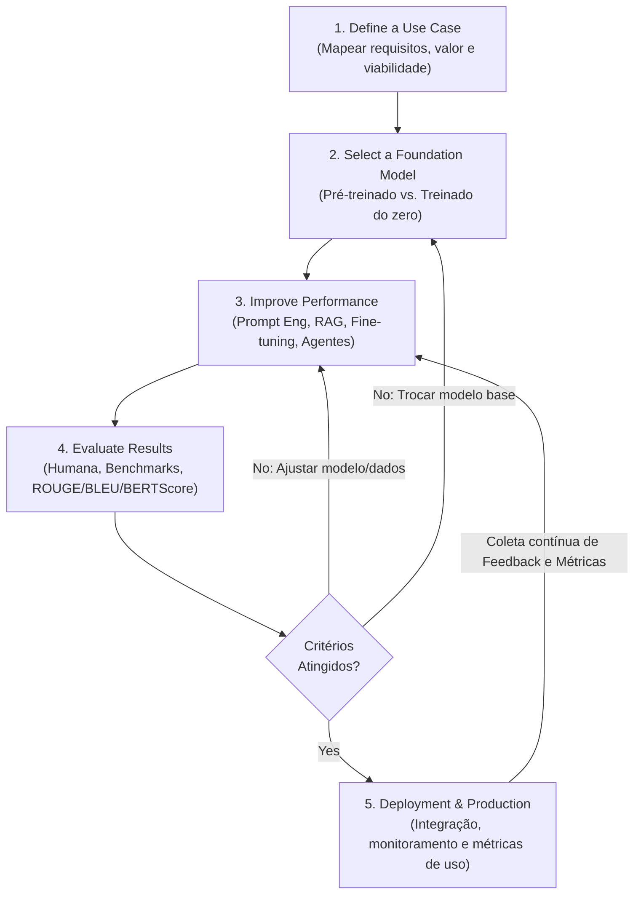
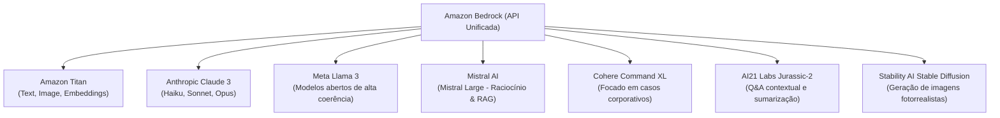
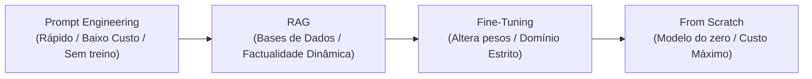
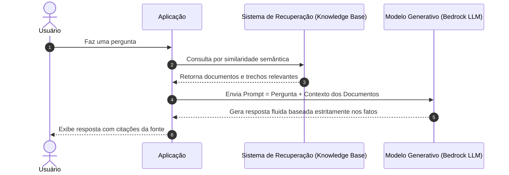
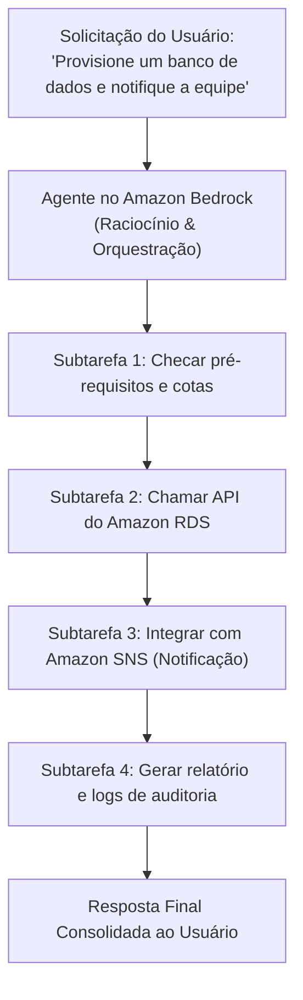

# Módulo 05 — Developing Generative Artificial Intelligence Solutions

---

## 📌 Introdução e Visão Geral do Curso

Este módulo explora o **Ciclo de Vida de Aplicações de Inteligência Artificial Generativa (Generative AI Application Lifecycle)**. A IA Generativa permite que modelos poderosos gerem conteúdo com qualidade humana — desde narrativas cativantes e peças visuais até código de software funcional — através de instruções em linguagem natural (*prompts*).

As empresas já utilizam essa tecnologia para automatizar a criação de conteúdo, acelerar a descoberta de novos medicamentos, criar campanhas de marketing hiperpersonalizadas e reduzir custos operacionais.

Este curso atua como um guia fundamental (*primer*) para entender as decisões estratégicas de:
1. **Definição de casos de uso de negócio** e seus critérios de sucesso.
2. **Seleção do Foundation Model (FM)** mais adequado.
3. **Melhoria de performance** através de Prompt Engineering, RAG, Fine-tuning e Agentes.
4. **Avaliação rigorosa de desempenho** com métodos humanos, benchmarks e métricas automáticas.
5. **Implantação (Deploy)** e monitoramento alinhado aos objetivos da organização.

---

### Objetivos de Aprendizagem Formais

* Identificar critérios técnicos e de negócio para seleção de modelos pré-treinados.
* Definir **Retrieval Augmented Generation (RAG)** e descrever suas aplicações corporativas.
* Explicar os **trade-offs de custo versus acurácia** entre as diferentes técnicas de customização de FMs.
* Compreender o papel fundamental de **Agentes de IA** na orquestração de tarefas multietapas autônomas.
* Compreender os métodos de avaliação de desempenho de Foundation Models.
* Identificar métricas relevantes (como ROUGE, BLEU e BERTScore) para aferir a qualidade de modelos generativos.

---

## 1. O Ciclo de Vida da Aplicação de IA Generativa

Antes de executar as etapas, é fundamental ter clareza sobre as capacidades nativas e os desafios intrínsecos da IA Generativa:

### 1.1 Capacidades vs. Desafios da IA Generativa

```
┌───────────────────────────────────────────────┬───────────────────────────────────────────────┐
│        7 CAPACIDADES DA IA GENERATIVA         │          7 DESAFIOS DA IA GENERATIVA          │
├───────────────────────────────────────────────┼───────────────────────────────────────────────┤
│ 1. Adaptabilidade (múltiplas tarefas e temas) │ 1. Violações Regulatórias (vazamento de PII)  │
│ 2. Responsividade (respostas em tempo real)   │ 2. Riscos Sociais (danos à imagem da marca)   │
│ 3. Simplicidade (reduz esforço operacional)   │ 3. Segurança e Privacidade de Dados sensíveis │
│ 4. Criatividade e Exploração (ideias inéditas)│ 4. Toxicidade (linguagem ofensiva/nociva)     │
│ 5. Eficiência de Dados (aprende com pouco)    │ 5. Alucinações (respostas falsas e confiantes)│
│ 6. Personalização (conteúdo sob medida)       │ 6. Interpretabilidade (entender o raciocínio) │
│ 7. Escalabilidade (geração em massa rápida)   │ 7. Não-Determinismo (outputs variados/iguais) │
└───────────────────────────────────────────────┴───────────────────────────────────────────────┘
```

---

### 1.2 Os 5 Estágios do Ciclo de Vida de Aplicações Generativas

O **Generative AI Application Lifecycle** é o processo sistemático de incorporação e sustentação de modelos generativos em sistemas produtivos:



#### Detalhamento das 5 Etapas:

1. **Stage 1 — Define a Use Case (Definir o Caso de Uso):**
   * Identifica onde a IA Generativa adiciona valor real analisando as funcionalidades da aplicação, necessidades dos usuários e metas de negócio.
2. **Stage 2 — Select a Foundation Model (Selecionar o Modelo Base):**
   * Com base nos requisitos, escolhe-se um modelo pré-treinado existente ou opta-se pelo desenvolvimento de um modelo customizado do zero. Considera disponibilidade de modelos, complexidade da tarefa e dados de domínio.
3. **Stage 3 — Improve Performance (Aprimorar a Performance):**
   * O modelo é integrado à base de código e infraestrutura da aplicação. Envolve adaptação de formatos de entrada/saída, otimização de prompts, conexão com bases de dados via RAG ou fine-tuning de parâmetros.
4. **Stage 4 — Evaluate Results (Avaliar Resultados):**
   * Condução de testes profundos com entradas diversas, casos de borda (*edge cases*) e cenários reais para aferir qualidade, coerência, relevância e segurança do conteúdo gerado.
5. **Stage 5 — Deployment & Continuous Improvement (Deploy e Melhoria Contínua):**
   * Publicação em ambiente de produção com sistemas de monitoramento para rastrear latência, custos, uso e vieses. O ciclo é **estritamente iterativo**: o feedback contínuo dos usuários alimenta novos ajustes de prompts, fine-tuning ou retreinamento.

---

## 2. Fase 1: Definindo o Caso de Uso (Defining the Use Case)

Esta etapa inicial estabelece a fundação de todo o projeto:
* **Define o problema exato** a ser resolvido.
* **Coleta os requisitos técnicos e funcionais**.
* **Alinha as expectativas** dos stakeholders.

> ⚠️ Acertar esta fase é imperativo: falhar na definição do problema compromete todas as decisões posteriores de modelo, infraestrutura e custos.

---

### 2.1 As 11 Partes de um Business Use Case Bem Definido

Um caso de uso de negócio é uma narrativa estruturada que documenta o comportamento esperado do sistema:

| Elemento | Descrição e Finalidade |
|---|---|
| **1. Use case name** | Nome curto e descritivo que identifica claramente o caso de uso. |
| **2. Brief description** | Resumo em alto nível do propósito e objetivo principal do caso de uso. |
| **3. Actors (Atores)** | Entidades que interagem com o sistema (usuários humanos, clientes, atendentes ou sistemas externos via API). |
| **4. Preconditions** | Condições que precisam ser verdadeiras antes que o caso de uso possa ser iniciado. |
| **5. Basic flow (Main success scenario)** | Roteiro passo a passo das interações no cenário ideal onde tudo funciona com sucesso (**happy path**). |
| **6. Alternative flows (Extensions)** | Caminhos alternativos e planos de contingência para tratar exceções, erros ou escolhas incomuns do usuário. |
| **7. Postconditions** | O estado ou condições garantidas que o sistema deve apresentar após o término com sucesso. |
| **8. Business rules** | Políticas internas, regras de compliance, restrições operacionais e regulamentações que governam a ação. |
| **9. Nonfunctional requirements** | Requisitos técnicos não-funcionais (tempo de resposta/latência, segurança, criptografia, usabilidade). |
| **10. Assumptions** | Premissas assumidas sobre a infraestrutura, ambiente ou contexto para que o caso de uso seja válido. |
| **11. Notes or additional information** | Observações, explicações adicionais ou detalhes úteis para a equipe de engenharia e produto. |

---

### 2.2 Métricas de Sucesso do Negócio para IA Generativa

O retorno do investimento em IA Generativa deve ser mensurado por métricas econômicas e operacionais:

1. **Cost Savings (Redução de Custos):** Diminuição direta de despesas operacionais com mão de obra repetitiva, otimização de processos e eficiência operacional.
2. **Time Savings (Economia de Tempo):** Redução mensurável do tempo de ciclo de execução de uma tarefa (ex.: gerar um relatório em 2 minutos em vez de 4 horas).
3. **Quality Improvement (Melhoria de Qualidade):** Aumento da coerência, precisão factual e criatividade das saídas geradas.
4. **Customer Satisfaction (Satisfação do Cliente):** Mensurada via NPS (Net Promoter Score), pesquisas de satisfação (CSAT) ou análise de sentimento das interações.
5. **Productivity Gains (Ganhos de Produtividade):** Aumento do volume de entregas por funcionário, diminuição da taxa de erros e aceleração do trabalho especializado.

---

### 2.3 Abordagens Estratégicas com IA Generativa

* **Process Automation (Automação de Processos):** Automatização de tarefas manuais e lentas (atendimento inicial, extração de relatórios, catalogação).
* **Augmented Decision-Making (Tomada de Decisão Ampliada):** O modelo analisa grandes bases de dados heterogêneas e sintetiza tendências e recomendações que auxiliam os líderes a tomarem decisões embasadas.
* **Personalization and Customization (Hiperpersonalização):** Geração de recomendações, mensagens e ofertas sob medida para cada cliente, aumentando o engajamento e fidelidade.
* **Creative Content Generation (Geração de Conteúdo Criativo):** Criação escalável de artigos, peças publicitárias, roteiros, ilustrações e materiais didáticos.
* **Exploratory Analysis and Innovation (Análise Exploratória e Inovação):** Teste e exploração rápida de novas combinações de hipóteses, ideias de novos produtos e sínteses de pesquisa científica.

---

## 3. Fase 2: Seleção de um Foundation Model (Selecting an FM)

A escolha do modelo base dita a capacidade, o custo e os limites de engenharia da solução. Uma das primeiras decisões é: **utilizar um modelo pré-treinado existente ou construir um do zero?**

> **Modelos Pré-Treinados:** Oferecem uma vantagem inicial imensa (*head start*) por encapsularem bilhões de padrões da linguagem e do conhecimento humano. Requerem menos tempo e dados, mas podem carregar vieses e desconhecer regras proprietárias de nicho.

---

### 3.1 Os 10 Critérios de Seleção de Modelos Pré-treinados

Ao comparar modelos no mercado, analise estes 10 fatores:

| Critério | O que analisar | Impacto no Projeto |
|---|---|---|
| **1. Cost (Custo)** | Licenciamento, preço por token (entrada/saída) e custo de computação para inferência. | Define a viabilidade orçamentária do produto em escala. |
| **2. Modality (Modalidade)** | Texto, imagem, áudio, código ou multimodal (ex.: imagem + texto na entrada). | Deve atender exatamente ao tipo de mídia exigido pelo caso de uso. |
| **3. Latency (Latência)** | Tempo necessário para gerar o primeiro token e a resposta completa. | Crítico para sistemas em tempo real (chatbots interativos) versus processos batch. |
| **4. Multi-lingual Support** | Capacidade nativa de compreender e responder fluentemente em vários idiomas. | Evita a necessidade de etapas extras de tradução intermediária. |
| **5. Model Size (Tamanho)** | Quantidade total de parâmetros treinados (ex.: 7B, 70B parâmetros). | Modelos maiores exigem hardware mais pesado; modelos menores rodam mais rápido e barato. |
| **6. Model Complexity** | Arquitetura subjacente (ex.: Transformers densos vs. Mixture of Experts - MoE). | Modelos mais complexos lidam com raciocínio lógico avançado, mas são mais difíceis de otimizar. |
| **7. Customization** | Suporte a técnicas de fine-tuning e adaptação de pesos com dados do cliente. | Necessário para empresas que precisam fixar terminologias restritas e estilos específicos. |
| **8. Input/Output Length** | Janela de contexto (*context window*) máxima para leitura e tamanho máximo da resposta. | Crucial para aplicações que analisam documentos jurídicos extensos ou livros inteiros. |
| **9. Responsibility** | Histórico de segurança, filtros de toxicidade, riscos de desinformação e origem dos dados. | Protege a empresa contra processos legais e danos à reputação da marca. |
| **10. Deployment & Integration** | Facilidade de integração via APIs gerenciadas (ex.: Amazon Bedrock) e SDKs. | Reduz o tempo de desenvolvimento (*time-to-market*) da equipe técnica. |

---

### 3.2 Catálogo de Foundation Models Disponíveis no Amazon Bedrock

O Amazon Bedrock oferece acesso unificado via API aos modelos mais prestigiados da indústria:



* **1. AI21 Labs (Jurassic-2 / J2):** Família de modelos de linguagem de ponta ideal para construir aplicações com dados organizacionais existentes. Excelente para geração de texto curto e longo, Q&A contextual, resumos e tarefas de classificação.
* **2. Amazon Titan:** Família proprietária desenvolvida pela AWS, pré-treinada em datasets massivos. Subdividida em três tipos:
  * *Amazon Titan Text:* Geração de texto, síntese e raciocínio.
  * *Amazon Titan Embeddings:* Conversão de texto em representações vetoriais para busca semântica e RAG.
  * *Amazon Titan Image Generator:* Criação e edição de imagens de estúdio a partir de comandos textuais.
* **3. Anthropic (Claude 3):** Família de modelos estado da arte para visão computacional e texto. Apresenta três versões que equilibram inteligência, velocidade e custo:
  * *Claude 3 Haiku:* Ultrarrápido e super econômico (ideal para atendimento ágil).
  * *Claude 3 Sonnet:* Equilíbrio perfeito entre inteligência corporativa e velocidade.
  * *Claude 3 Opus:* Inteligência máxima para raciocínio analítico profundo e tarefas científicas complexas.
* **4. Cohere (Command XL):** LLM corporativo desenhado especificamente para aplicações empresariais confiáveis: copywriting, resumos executivos, diálogo estruturado, extração de entidades e Q&A.
* **5. Meta (Llama 3):** Família baseada na arquitetura transformer, treinada em dados públicos de larga escala. Destaca-se pela fluidez, contexto estendido e geração de texto coerente.
* **6. Mistral AI (Mistral Large):** Modelo de raciocínio de alta precisão científica. Excelente para problemas complexos que envolvem geração de código, texto sintético, agentes e RAG.
* **7. Stability AI (Stable Diffusion):** Modelo líder global em geração de imagens fotorrealistas a partir de instruções textuais (*text-to-image*).

---

## 4. Fase 3: Aprimorando o Desempenho do Modelo (Improving Performance)

Após selecionar o modelo base, recorre-se a técnicas de especialização para adequá-lo às peculiaridades da empresa:



---

### 4.1 Engenharia de Prompt (Prompt Engineering)

É o meio **mais rápido e barato** de interagir com Foundation Models. Consiste na elaboração intencional de perguntas, declarações e diretrizes de contexto para direcionar a saída do LLM sem alterar seus parâmetros matemáticos.

#### Os 5 Pilares da Engenharia de Prompt:
1. **Design:** Construir instruções claras, inequívocas e ricas em contexto sobre o papel esperado e o formato da saída.
2. **Augmentation:** Adicionar restrições, regras negativas (*o que não fazer*) e exemplos de demonstração.
3. **Tuning:** Refinar iterativamente a redação do prompt observando erros e ajustando as saídas.
4. **Ensembling:** Combinar respostas de diferentes prompts ou estratégias de geração para criar uma resposta consensual e robusta.
5. **Mining:** Buscar e resgatar os melhores templates de prompts a partir de bibliotecas e repositórios organizacionais.

#### Principais Técnicas de Prompting:
* **Zero-shot Prompting:** Executa a tarefa diretamente sem nenhum exemplo de suporte.
* **Few-shot Prompting:** Fornece alguns exemplos de pares (entrada $\to$ saída desejada) antes de pedir o resultado final.
* **Chain-of-Thought (CoT):** Instrui o modelo a "pensar passo a passo" antes de concluir, elevando a precisão em raciocínio lógico.
* **Self-Consistency:** Gera múltiplos caminhos de raciocínio e adota a resposta de consenso mais frequente.
* **Tree of Thoughts (ToT):** Permite ao modelo explorar múltiplas ramificações de pensamentos e realizar retrocesso (*backtracking*) quando necessário.
* **ReAct Prompting (Reason + Act):** Combina raciocínio em linguagem natural com ações externas (consultar ferramentas e APIs).
* **Automatic Reasoning and Tool-use (ART):** Seleciona ferramentas e raciocínios automaticamente com base em biblioteca de tarefas.

---

### 4.2 Retrieval Augmented Generation (RAG)

O **RAG** é uma técnica que integra **sistemas de recuperação de dados** a **modelos de linguagem generativos**, garantindo que as respostas sejam factualmente fundamentadas nas fontes da empresa.



#### Os 2 Componentes Essenciais do RAG:
1. **O Sistema de Recuperação (Retrieval System):** Busca passagens relevantes em grandes acervos textuais corporativos (arquivos, páginas web, manuais) utilizando técnicas de recuperação esparsa (BM25) ou recuperação vetorial densa (*embeddings*).
2. **O Modelo Generativo de Linguagem (Generative Language Model):** Recebe o contexto recuperado junto à pergunta do usuário e sintetiza uma resposta fluida, coerente e gramaticalmente correta.

#### Aplicações Corporativas do RAG:
* **Sistemas Inteligentes de Q&A:** Suporte ao cliente e centrais internas onde as respostas precisam refletir informações atualizadas de manuais e regulamentos.
* **Enriquecimento e Expansão de Bases de Conhecimento:** Reestruturação de informações antigas em resumos compreensíveis e catalogados.
* **Geração de Conteúdo Factualmente Seguro:** Criação de relatórios, laudos e análises sintetizando documentos de fontes primárias confiáveis sem alucinações.

#### Exemplos de Knowledge Bases no Amazon Bedrock:
* **Chatbot de Suporte Técnico:** Base de dados com especificações, tabelas de compatibilidade e manuais de troubleshooting $\to$ chatbot resolve dúvidas técnicas dos clientes de forma precisa.
* **Pesquisa Jurídica:** Base contendo jurisprudência, acórdãos e leis $\to$ assistente jurídico sumariza processos e identifica artigos de lei aplicáveis.
* **Assistente de Saúde:** Base com artigos clínicos, bulas e diretrizes hospitalares $\to$ assistente fornece respostas rápidas e estruturadas para equipes de saúde.

---

### 4.3 Fine-Tuning (Ajuste Fino de Parâmetros)

Consiste em pegar um modelo pré-treinado e continuar seu treinamento em um dataset específico de uma tarefa ou domínio, **alterando seus pesos neurais internos**:

#### Duas Abordagens de Fine-Tuning:
1. **Instruction Fine-Tuning:** Treina o modelo com pares de *[Instrução $\to$ Resposta Esperada]* para que ele aprenda a obedecer comandos em estilos ou formatos específicos (*Prompt tuning* é uma variação eficiente dessa categoria).
2. **Reinforcement Learning from Human Feedback (RLHF):** Utiliza um modelo de recompensa treinado com classificações humanas para alinhar as preferências do modelo aos valores, segurança e estilo desejados.

#### Os 5 Passos do Processo de Fine-Tuning:
```
[1. Modelo Base Pré-treinado]
             ↓
[2. Preparação do Dataset Específico da Tarefa (Pares Entrada/Saída)]
             ↓
[3. Adição de Camadas Customizadas (ex.: classificação ou projeção)]
             ↓
[4. Treinamento Supervisionado e Atualização dos Pesos Matemáticos]
             ↓
[5. Avaliação com Dataset de Teste e Iteração de Hiperparâmetros]
```

* **Exemplo de Uso:** Um modelo genérico pré-treinado pode ser ajustado (*fine-tuned*) com milhares de artigos médicos de periódicos científicos para incorporar vocabulário clínico estrito e raciocínio farmacológico.

---

### 4.4 Criando um Foundation Model do Zero (From Scratch)

Consiste em projetar a arquitetura neural, inicializar pesos aleatórios e treinar o modelo desde o início em um dataset bruto massivo, sem herdar conhecimento prévio:

* **Quando utilizar:** Situações raras em que **não existe nenhum modelo comercial ou aberto adequado** para o nicho de mercado (ex.: linguagem ultra-específica, formatos industriais proprietários ou requisitos regulatórios de segurança extrema).
* **Etapas:** Definição da arquitetura e hiperparâmetros $\to$ Curadoria e limpeza de terabytes/petabytes de dados $\to$ Inicialização aleatória dos pesos $\to$ Treinamento distribuído em clusters de GPUs/TPUs durante semanas ou meses minimizando a função de perda.
* **Trade-off:** Confere controle e customização totais, porém a um custo gigantesco de computação, tempo e demanda por especialistas seniores de pesquisa.

---

### 4.5 Comparativo e Trade-offs de Custo vs. Acurácia na Customização

```
      ▲ Acurácia / Especialização no Domínio
      │
 Alto │                                          [Modelo do Zero]
      │                                          (Custo Astronômico)
      │
Médio │                       [Fine-Tuning]
      │                   (Custo de Treino Médio)
      │
      │        [RAG]
      │  (Custo de Infra/Busca)
      │
Baixo │ [Prompt Engineering]
      │ (Custo Mínimo / Imediato)
      └─────────────────────────────────────────────────────────────►
        Baixo                 Médio                     Alto (Custo e Esforço)
```

| Abordagem | Altera Pesos do Modelo? | Custo Relativo | Necessidade de Dados Rotulados | Melhor Indicado Para |
|---|---|---|---|---|
| **Prompt Engineering** | ❌ Não | 🟢 Mínimo | Nenhuma | Prototipagem rápida, tarefas gerais de texto e testes iniciais. |
| **RAG** | ❌ Não | 🟡 Moderado | Nenhuma (usa dados brutos) | Fornecer dados corporativos atualizados e eliminar alucinações. |
| **Fine-Tuning** | ✅ Sim | 🟠 Alto | Alta (milhares de pares rotulados) | Ensinar jargões, formatos rígidos de saída ou estilos específicos de escrita. |
| **Model from Scratch** | ✅ Sim (Criação) | 🔴 Extremo | Extrema (terabytes/petabytes) | Projetos científicos pioneiros ou domínios onde modelos existentes falham totalmente. |

---

### 4.6 Agentes de IA: Automação de Tarefas Multietapas (Agents)

À medida que as aplicações generativas se tornam mais complexas, surge a necessidade de componentes de software que não apenas gerem texto, mas **executem ações autônomas**:

> **Definição de Agente:** Entidades de software autônomas ou semiautônomas capazes de decompor uma solicitação complexa em subtarefas sequenciais, chamar ferramentas externas (APIs, bancos de dados, código) e orquestrar sua conclusão.



#### 4 Capacidades Principais dos Agentes:
1. **Task Coordination (Coordenação de Tarefas):** Garante a execução das subtarefas na ordem correta, verificando dependências e pré-requisitos antes de avançar para a próxima ação.
2. **Reporting and Logging (Relatórios e Auditoria):** Registra logs detalhados do status de cada etapa, métricas de execução e diagnósticos de falha.
3. **Scalability and Concurrency (Escalabilidade e Concorrência):** Trata múltiplos fluxos operacionais complexos simultaneamente em paralelo.
4. **Integration and Communication (Integração e Comunicação):** Conecta-se a serviços corporativos através de APIs REST, filas de mensagens (SQS) e sistemas legados.

* **Exemplo no Amazon Bedrock:** Agentes podem receber comandos de linguagem natural para provisionar instâncias EC2, configurar load balancers, acionar rotinas de backup, aplicar políticas de auto-scaling e responder com o status consolidado da infraestrutura.

---

## 5. Fase 4: Avaliando um Foundation Model (Evaluating an FM)

Avaliar um FM significa verificar se suas saídas linguísticas atendem com rigor aos critérios de qualidade, verdade e utilidade para a organização.

### 5.1 Os 3 Métodos de Avaliação de Modelos Generativos

```
┌────────────────────────────────────────────────────────────────────────┐
│                    MÉTODOS DE AVALIAÇÃO DE FMs                         │
├───────────────────┬────────────────────────────┬───────────────────────┤
│ 1. AVALIAÇÃO      │ 2. BENCHMARK DATASETS      │ 3. MÉTRICAS           │
│    HUMANA         │    PADRONIZADOS            │    AUTOMATIZADAS      │
├───────────────────┼────────────────────────────┼───────────────────────┤
│ • Padrão-ouro     │ • Datasets curados         │ • Rápidas e           │
│   qualitativo     │   públicos                 │   escaláveis          │
│ • Avalia nuances, │ • Permitem comparar        │ • Medem aspectos      │
│   coerência e tom │   modelos concorrentes     │   específicos de      │
│ • Custo elevado e │ • Rastreiam o progresso    │   forma matemática    │
│   lento em escala │   da indústria             │ • Não captam sutilezas│
└───────────────────┴────────────────────────────┴───────────────────────┘
```

#### Detalhamento dos Métodos:
1. **Human Evaluation (Avaliação Humana):**
   * Avaliadores humanos analisam diálogos abertos, redações e resumos para dar notas qualitativas sobre coerência, fluidez, relevância e alinhamento à voz da marca. Considerado o padrão-ouro de fidelidade, porém custoso e inviável para milhões de amostras.
2. **Benchmark Datasets (Conjuntos de Teste Padronizados):**
   * **GLUE (General Language Understanding Evaluation):** Avalia entendimento geral de linguagem (classificação, inferência em linguagem natural).
   * **SuperGLUE:** Evolução mais desafiadora do GLUE, focada em raciocínio linguístico composicional complexo.
   * **SQuAD (Stanford Question Answering Dataset):** Avalia a capacidade de leitura e resposta exata a perguntas com base em artigos da Wikipedia.
   * **WMT (Workshop on Machine Translation):** Série de datasets para medir o desempenho de tradução automática entre pares de idiomas.
3. **Automated Metrics (Métricas Automatizadas):**
   * Medidas matemáticas escaláveis:
     * *Perplexity (Perplexidade):* Mede a incerteza do modelo ao prever o próximo token (quanto menor, mais confiante e previsível é o modelo).
     * *F1-Score:* Avalia precisão e recall em tarefas de extração de entidades ou classificação de texto.

---

### 5.2 As Métricas Específicas de IA Generativa: ROUGE, BLEU e BERTScore

| Métrica | Nome Completo | Foco Principal | Como Funciona |
|---|---|---|---|
| **ROUGE** | *Recall-Oriented Understudy for Gisting Evaluation* | Sumarização e Resumos | Foco em **Recall** (cobertura). Compara a quantidade de n-gramas do resumo de referência humano que foram capturados no resumo gerado pela IA. |
| **BLEU** | *Bilingual Evaluation Understudy* | Tradução Automática | Foco em **Precisão** de n-gramas com **Penalidade de Brevidade** (*Brevity Penalty*). Mede quantos n-gramas da tradução da máquina aparecem na tradução humana de referência, penalizando respostas artificialmente curtas. |
| **BERTScore** | *BERT-based Semantic Score* | Similaridade Semântica Profunda | Utiliza modelos BERT pré-treinados para extrair **embeddings contextuais** das palavras e calcula a **similaridade de cosseno** entre o texto gerado e a referência humana. Avalia o significado sem depender de palavras idênticas. |

> 💡 **Recomendação Oficial:** Nenhuma métrica automatizada isolada substitui a percepção humana. A melhor prática é combinar métricas automáticas quantitativas (para triagem rápida) com amostragem de avaliação humana (para validação qualitativa final).

---

## 6. Fase 5: Implantando a Aplicação (Deploying the Application)

A etapa de deploy conecta o modelo treinado/customizado aos sistemas de front-end, back-end e bancos de dados da empresa, transformando o protótipo em produto real.

### 6.1 Os 4 Fatores Críticos de Deploy na Nuvem AWS

1. **Cost (Custo e Modelo de Preços):**
   * Serviços gerenciados como Amazon Bedrock operam sob modelo *pay-as-you-go* baseado no consumo real de tokens gerados e processados, sem taxas mínimas ou custos fixos de manutenção de servidores ociosos.
2. **Regions (Cobertura Regional):**
   * A disponibilidade de Foundation Models varia de acordo com as **Regiões da AWS**. Antes de iniciar o desenvolvimento, verifique se os modelos desejados (ex.: Claude 3, Llama 3, Titan) estão homologados na região onde seus dados e servidores operam.
3. **Quotas (Cotas e Limites de Serviço):**
   * Contas da AWS possuem limites padrão de throughput (requisições por minuto - RPM e tokens por minuto - TPM). É essencial monitorar o consumo e solicitar aumentos preventivos de cotas para evitar erros de *throttling* em picos de tráfego.
4. **Security & Shared Responsibility (Segurança da Informação):**
   * **Na infraestrutura AWS:** Vigora o **Modelo de Responsabilidade Compartilhada** (*Shared Responsibility Model*). A AWS garante a segurança física, isolamento de rede e proteção dos serviços; a organização é responsável pelo controle de acessos (IAM), criptografia de chaves (KMS) e políticas de guardrails.
   * **Modelos Externos:** Se os dados saírem da fronteira da conta AWS para modelos de terceiros, devem ser feitas análises rigorosas sobre conformidade com a LGPD/GDPR e termos de privacidade de tráfego.

---

## 🗂️ Síntese Estruturada para Revisão Rápida

* **Ciclo de Vida Generativo (5 Fases):** Definir Caso de Uso $\to$ Selecionar FM $\to$ Melhorar Performance $\to$ Avaliar Resultados $\to$ Deploy e Monitoramento Contínuo.
* **Componentes de um Use Case:** 11 seções (Nome, Descrição, Atores, Pré-condições, Fluxo Principal, Fluxos Alternativos, Pós-condições, Regras de Negócio, Requisitos Não-Funcionais, Premissas e Notas).
* **Métricas e Abordagens de Negócio:** Redução de custos, economia de tempo, aumento de qualidade, satisfação do cliente (NPS) e produtividade via automação, decisão aumentada e personalização.
* **Critérios de Seleção de Modelos (10):** Custo, Modalidade, Latência, Suporte Multilíngue, Tamanho, Complexidade, Customização, Janela de Entrada/Saída, IA Responsável e Facilidade de Integração.
* **Catálogo Bedrock:** Amazon Titan (texto, imagem, embeddings), Claude 3 (Haiku, Sonnet, Opus), Cohere Command, Llama 3, Mistral Large, AI21 Jurassic-2 e Stable Diffusion.
* **Técnicas de Melhoria de Performance:**
  * *Prompt Engineering:* Rápido, barato e sem treino (Zero-shot, Few-shot, CoT, ReAct).
  * *RAG:* Recuperador + Modelo Generativo; ancora respostas em bases reais (manuais, suporte, jurídico).
  * *Fine-Tuning:* Altera pesos com dados de tarefa específica (Instruction tuning e RLHF).
  * *From Scratch:* Treino do zero; controle total mas custo e esforço extremos.
* **Agentes de IA:** Orquestram tarefas multietapas (coordenação, logs, concorrência, integração com APIs da AWS).
* **Métodos de Avaliação de FMs:**
  * *Humana:* Qualitativa, flexível, cara e lenta.
  * *Benchmarks:* GLUE, SuperGLUE, SQuAD, WMT.
  * *Métricas Automáticas:* ROUGE (resumos/recall), BLEU (tradução/precisão com penalidade de tamanho) e BERTScore (semântica contextual profunda via embeddings BERT).
* **Deploy AWS:** Atenção a custos por token, regiões disponíveis, cotas de requisições e segurança compartilhada.

---

*Módulo 05 — Developing Generative AI Solutions | Resumo Integral, Detalhado e Autossuficiente | Atualizado em: Setembro/2026*
