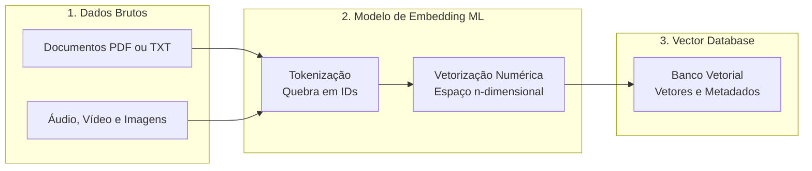
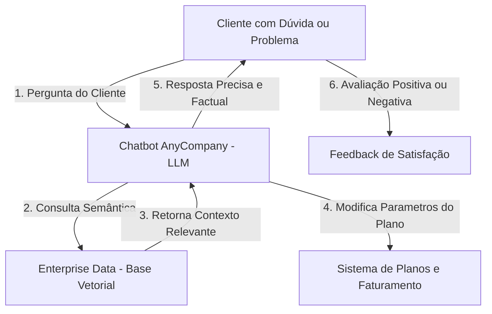
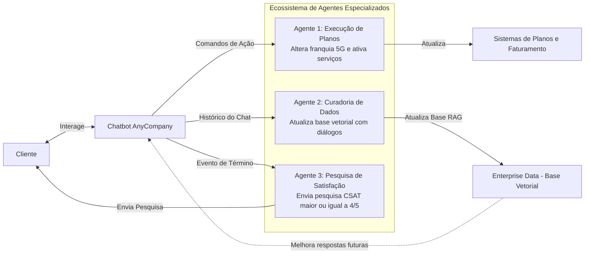
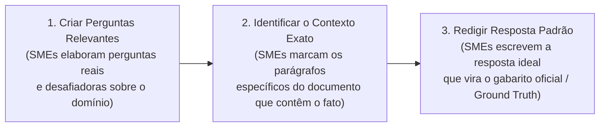
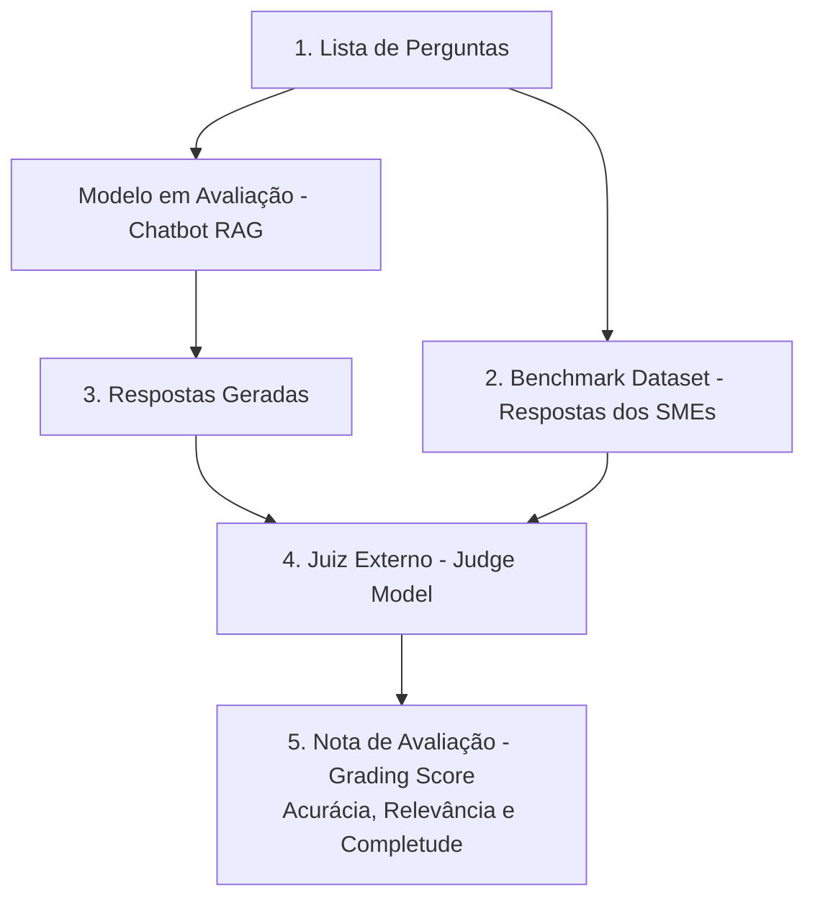
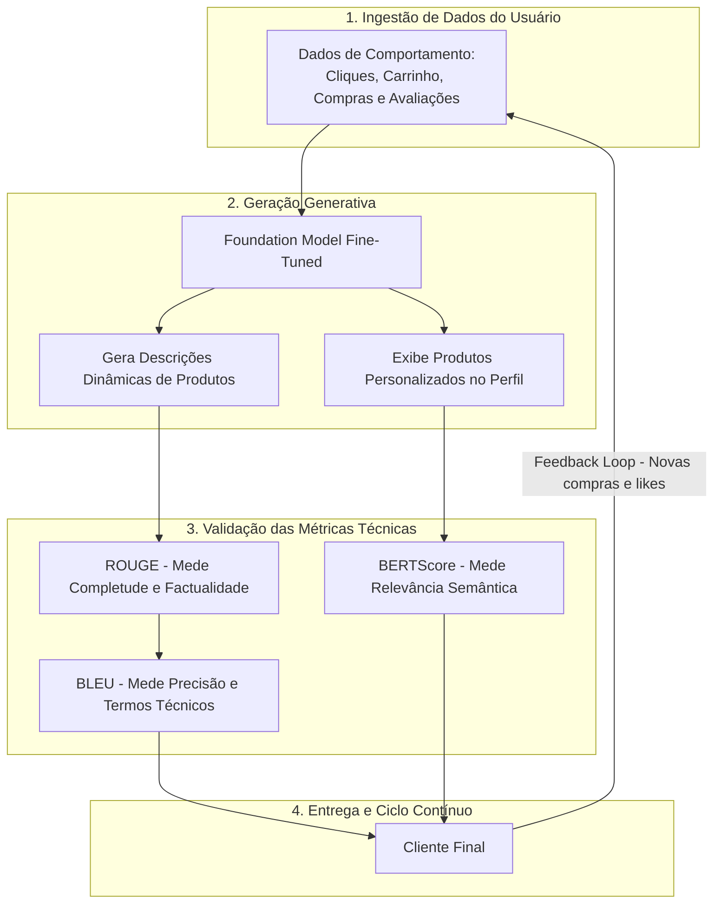
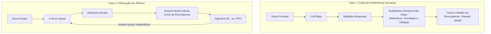

# Módulo 06 — Optimizing Foundation Models

---

## 📌 Visão Geral do Curso (Course Overview)

Este módulo foca nas duas técnicas principais para especializar e elevar o desempenho de **Foundation Models (FMs)**: **Retrieval-Augmented Generation (RAG)** e **Fine-Tuning (Ajuste Fino)**. 

Ao longo deste estudo, você aprenderá:
* Como transformar dados corporativos brutos em **Vector Embeddings** e quais serviços da AWS fornecem bancos de dados vetoriais para buscas semânticas ultrarrápidas.
* O papel dos **Agentes de IA** na orquestração e execução de tarefas multietapas autônomas conectadas a sistemas corporativos de backend.
* Métodos rigorosos para avaliar o desempenho de FMs, incluindo **Avaliação Humana**, **Criação de Benchmark Datasets** e a abordagem automatizada **LLM-as-a-Judge**.
* Como preparar e curar dados de alta qualidade para o processo de **Fine-Tuning** (Instruction Tuning, RLHF, Adaptação de Domínio, Transfer Learning e Continuous Pretraining).
* Como mensurar a qualidade técnica do texto gerado utilizando métricas como **ROUGE**, **BLEU** e **BERTScore**, conectando-as diretamente às métricas de sucesso de negócio (Taxa de Conversão, Ticket Médio e Retenção).

---

### Objetivos de Aprendizagem Formais

* Identificar os serviços AWS que suportam armazenamento e consulta de embeddings através de bancos de dados vetoriais.
* Compreender o papel fundamental de agentes na automação de tarefas multietapas.
* Compreender as abordagens qualitativas e quantitativas para avaliar a performance de FMs.
* Definir métodos estruturados para realizar o fine-tuning de um Foundation Model.
* Descrever os procedimentos necessários para coletar, curar e preparar dados para fine-tuning.
* Determinar se um FM atende com eficácia aos objetivos de negócio com base nos KPIs estabelecidos no caso de uso.

---

## 1. Estudo de Caso 1: AnyCompany Telecom (Suporte e Atendimento)

Para contextualizar o valor de RAG e Agentes, o módulo introduz o caso da **AnyCompany Telecom**, uma provedora de serviços de telefonia móvel e internet banda larga.

### 1.1 O Desafio de Negócio e Metas (KPIs)
* **Cenário Atual:** Clientes com problemas técnicos ou dúvidas sobre faturas entram em contato via telefone. O atendimento por voz é extremamente caro, lento e ineficiente.
* **Tentativa Anterior:** A empresa criou uma seção de FAQ estático no site. Apesar disso, o volume de chamados online e tickets abertos continuou muito alto.
* **A Nova Solução Proposta:** Desenvolver um **Chatbot com IA Generativa** capaz de:
  1. Guiar os clientes e resolver dúvidas frequentes de forma conversacional.
  2. Executar ações e tarefas de forma autônoma (ex.: pedir um novo aparelho, realizar upgrade de plano para obter mais dados 5G, alterar configurações de conta).
* **Metas de Sucesso (KPIs Estabelecidos):**
  * 🎯 **Reduzir o volume de tickets online de suporte em 70%** após a entrada do chatbot em produção.
  * 🎯 **Atingir nota média de satisfação do cliente (CSAT) de no mínimo 4 de 5 estrelas** através de pesquisas aplicadas logo após a finalização do atendimento.

---

### 1.2 Por que apenas um FM / LLM não é suficiente?
Os LLMs comerciais são treinados em massas gigantescas de dados públicos da internet. Eles possuem excelente fluência linguística geral, mas:
* ❌ **Desconhecem os dados internos da empresa:** Não sabem detalhes contratuais dos planos da AnyCompany, histórico de chamados ou catálogo atualizado de aparelhos.
* ❌ **Não executam ações sozinhos:** Um LLM padrão apenas gera texto; ele não tem capacidade nativa de alterar o banco de dados de clientes para adicionar mais franquia de internet 5G.
* 💡 **Necessidade:** Unir o LLM a um sistema de **RAG** (para consultar a base de conhecimento proprietária) e a **Agentes** (para chamar APIs de backend e executar tarefas no cadastro do cliente).

---

## 2. Retrieval-Augmented Generation (RAG) e Embeddings Vetoriais

O RAG permite que o Foundation Model consulte bases de dados externas atualizadas antes de formular uma resposta ao usuário, eliminando alucinações e garantindo precisão factual.

### 2.1 Dos Dados Corporativos aos Vetores (Vector Embeddings)

Empresas acumulam petabytes de dados em manuais, laudos, contratos, planilhas e históricos de chamados. Para que esses dados se tornem pesquisáveis pelo modelo, eles passam pelo pipeline de **Tokenização e Vetorização**:



#### O que é um Vector Embedding?
Embedding é o processo matemático no qual textos, imagens ou áudios são transformados em **vetores numéricos (sequências de números reais em um espaço de $n$ dimensões)**.
* **Proximidade Semântica:** Palavras, frases e conceitos correlacionados convergem para coordenadas próximas no espaço vetorial.

```
Representação Conceitual de Embeddings:

No início do Treinamento (Pesos Aleatórios):
  [Sea]     ──> Vetor: [0.12, 0.85, 0.33, 0.91] (Cores/padrões aleatórios)
  [Ocean]   ──> Vetor: [0.77, 0.14, 0.62, 0.25] (Muito diferente de Sea)
  [Stapler] ──> Vetor: [0.45, 0.50, 0.88, 0.10]

Após o Treinamento no Modelo de Linguagem:
  [Sea]     ──> Vetor: [0.82, 0.41, 0.73, 0.15]  ┐
  [Ocean]   ──> Vetor: [0.84, 0.39, 0.71, 0.18]  ┘ (Vetores quase idênticos / Altíssima proximidade)
  [Stapler] ──> Vetor: [0.11, 0.95, 0.20, 0.80]    (Grampeador: Vetor totalmente distante e ortogonal)
```

---

### 2.2 Armazenamento de Vetores e Algoritmos de Busca

Bancos de dados vetoriais armazenam bilhões de vetores de alta dimensionalidade junto com seus metadados para viabilizar **buscas de similaridade ultrarrápidas em tempo real**.

#### Principais Algoritmos de Busca por Similaridade:
* **k-NN (k-Nearest Neighbors):** Encontra os $k$ vizinhos com as menores distâncias euclidianas no espaço geométrico.
* **Similaridade de Cosseno (Cosine Similarity):** Mede o cosseno do ângulo formado entre dois vetores. Quanto mais próximo de $1.0$, mais idêntico é o significado semântico (independente do tamanho do texto).

#### Opções de Bancos Vetoriais Nativos na AWS:
1. **Amazon OpenSearch Service (Provisioned):** Cluster dedicado para busca textual, analítica e vetorial em escala de petabytes.
2. **Amazon OpenSearch Serverless:** Modo sob demanda do OpenSearch com provisionamento automático de capacidade, sem necessidade de gerenciar nós.
3. **Extensão `pgvector` no Amazon RDS for PostgreSQL:** Adiciona suporte a busca vetorial diretamente dentro do banco relacional relacional PostgreSQL gerenciado pela AWS.
4. **Extensão `pgvector` no Amazon Aurora (PostgreSQL-Compatible):** Oferece altíssima performance, escalabilidade global e replicação contínua para busca vetorial corporativa.
5. **Amazon Kendra:** Mecanismo inteligente de busca corporativa com NLP integrado, pronto para indexar documentos corporativos (SharePoint, S3, Confluence) sem exigir esforço de configuração manual de vetores.

---

### 2.3 Arquitetura AnyCompany Telecom com RAG Integrado

Com o RAG implementado, o fluxo de atendimento da AnyCompany evolui da seguinte forma:



---

## 3. Agentes de IA na AnyCompany (Multi-Step Tasks)

Para que o Chatbot não fique limitado a apenas responder perguntas teóricas, a AnyCompany acopla **Agentes de IA** ao Foundation Model.

### 3.1 Funções-Chave dos Agentes
* **Operações Intermediárias (Intermediary operations):** Os agentes funcionam como pontes ativas entre o entendimento de linguagem natural do LLM e os sistemas de retaguarda da organização (ERPs, CRMs, ferramentas de bilhetagem e faturamento).
* **Disparo e Execução de Ações (Actions launch):** Capacidade de executar tarefas no mundo real com base na intenção expressa pelo cliente (ex.: alterar franquia de dados, processar pagamentos, cancelar serviços, gerar vouchers).
* **Integração de Feedback (Feedback integration):** Coleta dados e telemetria sobre os desfechos das ações executadas para retroalimentar e aprimorar o sistema ao longo do tempo.

---

### 3.2 Arquitetura dos 3 Agentes da AnyCompany Telecom

Na arquitetura de produção do curso, a AnyCompany distribui as responsabilidades entre **3 agentes especializados**:



* **Agente 1 (Modificação de Contas e Planos):** Lê a intenção do cliente via prompt, valida permissões e chama as APIs do sistema de telecom para modificar parâmetros de planos móveis ou de fibra óptica.
* **Agente 2 (Alimentação Contínua da Base de Conhecimento):** Analisa a transcrição das conversas bem-sucedidas entre usuários e atendentes, extrai novas soluções encontradas e atualiza dinamicamente o banco corporativo (*Enterprise Data*). Esse enriquecimento melhora a base RAG para os próximos clientes.
* **Agente 3 (Monitoramento de CSAT):** Monitora o fluxo do diálogo e, no momento em que identifica o término da sessão de suporte, envia automaticamente a pesquisa de satisfação para acompanhar a meta de manter a nota média $\ge 4/5$.

---

## 4. Avaliação de Desempenho de Modelos com RAG

A avaliação é essencial para garantir a eficácia técnica antes do deploy e medir a satisfação real do usuário depois da implantação.

### 4.1 Avaliação Humana vs. Datasets de Benchmark

| Critério | Avaliação Humana (Human Evaluation) | Benchmark Datasets (Testes Quantitativos) |
|---|---|---|
| **Definição** | Usuários reais ou especialistas avaliam o modelo interagindo e atribuindo notas. | Conjuntos pré-compilados de perguntas, contextos e respostas-padrão auditadas. |
| **Pontos Fortes** | Avalia **qualidade da experiência (UX)**, fluidez natural, adequação contextual, empatia e criatividade. | Avaliação **objetiva, matemática, repetível** de acurácia, velocidade, latência e custo computacional. |
| **Desvantagens** | Cara, lenta e de difícil replicação em larga escala. | Não capta sutilezas emocionais, sarcasmo e nuances da comunicação humana. |
| **Momento Ideal** | Melhorias iterativas e validação de qualidade em produção (*pós-deploy*). | Homologação técnica inicial, testes de regressão e comparação entre versões de modelos (*pré-deploy*). |

---

### 4.2 Como Criar um Benchmark Dataset para Sistemas RAG (Os 3 Passos)

A construção de um dataset de teste representativo é um processo manual e rigoroso conduzido por especialistas no domínio (**SMEs - Subject Matter Experts**):



#### Exemplo Prático de Extração de Contexto (Documento de Reciclagem):
* **Documento Base:** *"The Recycling Process of Plastic Bottles"*
* **Passo 1 (Pergunta elaborada):** *"Como as garrafas limpas são transformadas em resina plástica?"*
* **Passo 2 (Contexto identificado pelo SME):** Trecho selecionado no texto:
  > *"4. Shredding and Melting: The clean bottles are shredded into small pieces and melted down to form a plastic resin."*
* **Passo 3 (Gabarito oficial):** *"As garrafas limpas são trituradas em pedaços pequenos e derretidas para formar uma resina plástica."*

---

### 4.3 A Abordagem "LLM as a Judge" (Avaliador Automatizado)

Para evitar os altos custos da avaliação humana contínua, utiliza-se a arquitetura de **LLM como Juiz**: um modelo de linguagem independente e de alta capacidade (ex.: Claude 3 Opus ou Mistral Large) atua como árbitro para auditar o modelo sob teste.



#### As 3 Dimensões do Grading Score:
1. **Accuracy (Acurácia / Correção):** O modelo gerou afirmações verdadeiras com base no contexto fornecido pelos SMEs?
2. **Relevance (Relevância):** A resposta respondeu diretamente à dúvida do usuário sem enrolações ou fuga de tema?
3. **Comprehensiveness (Compreensão / Completude):** A resposta cobriu todos os ângulos essenciais com profundidade adequada?

---

## 5. Estudo de Caso 2: AnyCompany Fashion Retailer (E-commerce de Moda)

O segundo caso do módulo demonstra como o **Fine-Tuning** e as **métricas de NLP** aumentam o faturamento de uma loja online de roupas e calçados.

### 5.1 O Desafio Comercial e os 3 KPIs
* **O Problema:** Clientes da AnyCompany Fashion Retailer abandonavam carrinhos com frequência e realizavam pouquíssimas compras recorrentes. Os usuários ficavam sobrecarregados com o catálogo imenso e tinham dificuldade em encontrar peças alinhadas ao seu estilo pessoal.
* **A Solução:** Ajustar um LLM (*fine-tuning*) para gerar **descrições dinâmicas de produtos** e fazer **recomendações personalizadas de vitrine** em tempo real.
* **Os 3 KPIs de Negócio Monitorados:**
  1. 📈 **Conversion Rate (Taxa de Conversão):** Percentual de visitas ao site que resultam em compra efetiva.
  2. 💵 **Average Order Value (Ticket Médio):** Valor monetário médio gasto em cada transação.
  3. 🔁 **Customer Retention Rate (Taxa de Retenção de Clientes):** Percentual de clientes que voltam a comprar na loja.

---

### 5.2 Arquitetura de Recomendação e Feedback Loop



---

## 6. Fine-Tuning: Métodos, Preparação de Dados e Ciclo de Vida

Fine-tuning é o processo de pegar um modelo pré-treinado e **continuar o treinamento atualizando seus pesos matemáticos** em um dataset especializado para adaptar seu comportamento e estilo.

### 6.1 Por que Fazer Fine-Tuning? (Os 4 Benefícios)
1. **Aumentar a Especificidade:** Ajusta as saídas do modelo a nuances, jargões e regras estritas de um setor (jurídico, financeiro, telecomunicações).
2. **Melhorar a Acurácia:** Reduz erros grosseiros decorrentes da natureza generalista do treinamento inicial.
3. **Reduzir Vieses:** Corrige desvios e estereótipos presentes nos dados massivos da internet, adequando o modelo às normas corporativas e leis.
4. **Impulsionar a Eficiência:** Permite que um modelo menor especializado performe tão bem ou melhor que um modelo gigante generalista, reduzindo custos de inferência e latência.

---

### 6.2 Os 5 Métodos de Fine-Tuning e Especialização

```
┌────────────────────────────────────────────────────────────────────────┐
│                   MÉTODOS DE ESPECIALIZAÇÃO DE FMs                     │
├──────────────────────────┬─────────────────────────────────────────────┤
│ 1. Instruction Tuning    │ Retreina com pares [Instrução ➔ Resposta].  │
│                          │ O modelo aprende a obedecer comandos melhor.│
├──────────────────────────┼─────────────────────────────────────────────┤
│ 2. RLHF (Human Feedback) │ Usa um modelo de recompensa treinado por    │
│                          │ notas humanas para alinhar valores e estilo.│
├──────────────────────────┼─────────────────────────────────────────────┤
│ 3. Adaptação de Domínio  │ Treina em corpora textuais de um setor      │
│                          │ inteiro (ex.: laudos médicos ou leis).      │
├──────────────────────────┼─────────────────────────────────────────────┤
│ 4. Transfer Learning     │ Reutiliza representações gerais aprendidas  │
│                          │ aplicando-as a uma tarefa mais estreita.    │
├──────────────────────────┼─────────────────────────────────────────────┤
│ 5. Continuous Pretraining│ Alimenta o modelo continuamente com novos   │
│                          │ dados sem reiniciar o pré-treinamento.      │
└──────────────────────────┴─────────────────────────────────────────────┘
```

#### Detalhamento do Fluxo de RLHF:



---

### 6.3 Comparativo: Dados de Treinamento Inicial vs. Dados de Fine-Tuning

| Dimensão | Treinamento Inicial (Pretraining) | Fine-Tuning de Especialização |
|---|---|---|
| **Volume de Dados** | Petabytes / Terabytes de texto massivo. | Datasets pequenos e hipercurados (centenas a milhares de exemplos). |
| **Foco** | Cobertura abrangente, diversidade e capacidade de generalização. | **Especificidade e alta relevância** para a tarefa final. |
| **Origem dos Dados** | Raspagem da internet pública, livros, repositórios abertos. | Histórico interno de chats, laudos corporativos, dados transacionais. |
| **Rotulagem** | Não supervisionado / Auto-supervisionado. | Supervisionado com **rótulos rigorosos e pares de perguntas e respostas**. |
| **Qualidade vs. Quantidade**| **Quantidade massiva** com limpeza estatística. | **Qualidade extrema** sobre a quantidade de linhas. |

#### 5 Passos Críticos na Preparação de Dados para Fine-Tuning:
1. **Data Curation (Curadoria de Dados):** Seleção rigorosa para garantir que apenas exemplos pertinentes e corretos entrem na base.
2. **Labeling (Rotulagem):** Garantir que as respostas desejadas sigam o tom, a gramática e o formato exatos de saída.
3. **Governance and Compliance (Governança e Conformidade):** Anonymização completa de dados pessoais (PII) e adequação regulatória.
4. **Representativeness and Bias Checking:** Garantir que o dataset represente a diversidade de clientes sem reforçar preconceitos.
5. **Feedback Integration:** Incorporação contínua de correções feitas por humanos e métricas de satisfação.

---

## 7. Métricas de Avaliação Textual de FMs: ROUGE, BLEU e BERTScore

Para aferir numericamente se o modelo gera textos coerentes em comparação com referências escritas por humanos, utilizam-se três métricas universais:

```
┌────────────────────────────────────────────────────────────────────────┐
│               AS 3 MÉTRICAS UNIVERSAIS DE TEXTO EM GENAI               │
├────────────────────┬────────────────────┬──────────────────────────────┤
│    1. ROUGE        │     2. BLEU        │        3. BERTScore          │
│ (Foco em RECALL)   │(Foco em PRECISÃO)  │   (Foco em SEMÂNTICA REAL)   │
├────────────────────┼────────────────────┼──────────────────────────────┤
│ Mede quanto do     │ Mede quanto do que │ Mede similaridade de cosseno │
│ texto humano de    │ o modelo gerou     │ entre os embeddings de BERT; │
│ referência foi     │ aparece no texto   │ captura paráfrases e         │
│ coberto pelo modelo│ de referência      │ sinônimos contextuais        │
└────────────────────┴────────────────────┴──────────────────────────────┘
```

---

### 7.1 Detalhamento Técnico das Métricas

#### 1. ROUGE (Recall-Oriented Understudy for Gisting Evaluation)
* **Objetivo:** Avaliar a qualidade de resumos e sínteses textuais comparando a sobreposição de palavras e frases com textos de referência humanos.
* **Variações Comuns:**
  * **ROUGE-N:** Mede a sobreposição de $n$-gramas:
    * *ROUGE-1:* Sobreposição de palavras individuais (*unigrams*).
    * *ROUGE-2:* Sobreposição de pares de palavras consecutivas (*bigrams*).
  * **ROUGE-L:** Avalia a **Maior Subsequência Comum (Longest Common Subsequence - LCS)**. Preserva a ordem natural das palavras e avalia a fluidez e a coerência narrativa.
* **Vantagens:** Simples de interpretar e altamente correlacionado com o julgamento humano para resumos.

#### 2. BLEU (Bilingual Evaluation Understudy)
* **Objetivo:** Avaliar a qualidade de traduções automáticas ou precisão lexical contra traduções humanas de referência.
* **Mecânica:** Mede a **precisão de $n$-gramas** (1-gram até 4-grams) e aplica obrigatoriamente a **Brevity Penalty (Penalidade de Brevidade)**:
  $$\text{BLEU} = \text{Brevity Penalty} \times \exp\left(\sum_{n=1}^{N} w_n \ln p_n\right)$$
* **Por que existe a Brevity Penalty?** Para impedir que o modelo "trapaceie": se a frase humana for *"O gato preto dorme sob o tapete"* e o modelo responder apenas *"O"*, sua precisão seria 100%. A penalidade de brevidade derruba a nota de respostas artificialmente curtas.

#### 3. BERTScore
* **Objetivo:** Avaliar a **similaridade semântica profunda** sem depender de coincidências literais de palavras.
* **Mecânica:** Utiliza um modelo BERT pré-treinado para extrair vetores (*contextual embeddings*) para cada token do texto gerado e do texto de referência. Em seguida, calcula a **similaridade de cosseno** par a par:
  $$\text{Cosine Similarity} = \frac{\mathbf{u} \cdot \mathbf{v}}{\|\mathbf{u}\| \|\mathbf{v}\|}$$
* **Superpoder:** Não se deixa enganar por sinônimos ou paráfrases. Se a referência disser *"O paciente está febril"* e o modelo gerar *"A pessoa apresenta temperatura corporal elevada"*, o ROUGE e o BLEU darão notas baixas (palavras diferentes), mas o BERTScore dará uma nota altíssima por capturar que o sentido médico é exatamente o mesmo.

---

### 7.2 Resultados de Negócio Conquistados pela AnyCompany Fashion Retailer

A tabela a seguir demonstra a correspondência exata entre os avanços nas métricas técnicas de NLP e a evolução dos KPIs financeiros da empresa:

| Métrica Técnica de NLP | Score Atingido | O que a métrica garantiu | KPI de Negócio Impactado | Ganho Econômico Real |
|---|---|---|---|---|
| **ROUGE** | **0.85** | Alta sobreposição de informações essenciais e completude das fichas técnicas de produtos. | **Taxa de Conversão (Conversion Rate)** | 🚀 **Aumento de 15%** nas compras por visita. |
| **BLEU** | **0.78** | Alta precisão no vocabulário comercial, termos técnicos corretos e linguagem persuasiva de moda. | **Ticket Médio (Average Order Value)** | 💵 **Aumento de 20%** no valor gasto por pedido. |
| **BERTScore** | **0.90** | Excelente aderência semântica e relevância personalizada das vitrines e conselhos ao gosto do cliente. | **Retenção de Clientes (Retention Rate)** | 🔁 **Aumento de 25%** nos clientes que voltaram a comprar. |

---

## 🗂️ Síntese Estruturada para Revisão Rápida

* **RAG vs. Fine-Tuning:**
  * *RAG:* Consulta dados corporativos externos sem alterar os pesos do modelo; ideal para bases que mudam com frequência.
  * *Fine-Tuning:* Altera os pesos matemáticos do modelo para fixar jargões, formatos e estilos específicos.
* **Embeddings e Bancos Vetoriais na AWS:**
  * *Embeddings:* Transformação de texto/imagem em vetores numéricos de alta dimensão.
  * *Algoritmos de Busca:* k-NN (vizinhos mais próximos) e Similaridade de Cosseno (ângulo semântico).
  * *Serviços AWS:* OpenSearch Service, OpenSearch Serverless, RDS PostgreSQL com `pgvector`, Aurora PostgreSQL com `pgvector` e Amazon Kendra.
* **Agentes de IA (AnyCompany Telecom):**
  * *Agente 1:* Altera planos e parâmetros da conta do cliente no sistema de telecom.
  * *Agente 2:* Coleta conversas reais para enriquecer e atualizar a base RAG continuamente.
  * *Agente 3:* Dispara pesquisa de satisfação ao fim do chat para monitorar a meta de CSAT $\ge 4/5$.
* **Avaliação de Modelos RAG:**
  * *Humana:* Qualitativa, foca em UX e relevância, mas cara e lenta.
  * *Benchmarks (3 Passos):* SMEs criam perguntas $\to$ identificam trecho de contexto exato $\to$ redigem gabarito oficial.
  * *LLM as a Judge:* Modelo juiz externo audita respostas contra o gabarito e gera notas de Acurácia, Relevância e Completude.
* **Especialização de Modelos (Fine-Tuning):**
  * *Instruction Tuning:* Pares de comando e resposta.
  * *RLHF:* Treina Reward Model com preferências humanas para guiar algoritmo de reforço.
  * *Qualidade sobre Quantidade:* Fine-tuning exige poucos dados (centenas/milhares), mas com curadoria e rotulagem impecáveis.
* **Métricas de Texto e Casos de Negócio (Fashion Retailer):**
  * *ROUGE (0.85):* Foco em Recall $\to$ descrições completas $\to$ **+15% na Taxa de Conversão**.
  * *BLEU (0.78):* Foco em Precisão de n-gramas com penalidade de tamanho $\to$ termos corretos $\to$ **+20% no Ticket Médio**.
  * *BERTScore (0.90):* Foco em similaridade semântica profunda via embeddings de BERT $\to$ recomendações personalizadas $\to$ **+25% na Retenção de Clientes**.

---

*Módulo 06 — Optimizing Foundation Models | Resumo Integral, Detalhado e Autossuficiente | Atualizado em: Setembro/2026*
